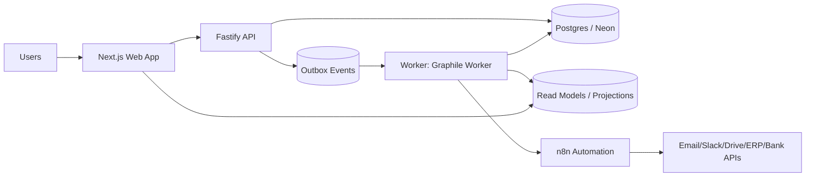

# AFENDA-NEXUS — Product + Architecture Proposal (PAP)

> **Business Truth Engine / “The Machine”**

| Field   | Value |
| ------- | ----- |
| Version | **v0.3 (Final Day-1 Execution Spec + Gap Closure)** |
| Date    | 2026-03-04 |
| Status  | Sprint 0 — foundation ✅ 13/14 complete (OTel deferred to Sprint 2) |
| Revision | **v0.3-R4 (status audit + next-phase plan)** |

---

## 0 — What changed from v0.1 → v0.3-R4

v0.1 was strong, but the gap review identified **missing pillars** that cause rework in ERP/fintech: **Auth**, **Evidence storage**, **Money model**, **Idempotency**, **Observability**, **API versioning**, **Test strategy**.

**v0.3 closes those gaps explicitly** (or marks them intentionally deferred with a note).

### v0.3-R2 → v0.3-R3 changelog

| Area | Change |
| --- | --- |
| **Monorepo scaffolded** | All 4 packages + 4 apps created, booted, and type-checking |
| **DB migrated** | 20 tables generated and applied (Drizzle) |
| **Seed data** | Demo organization, admin principal, RBAC, CoA, sequences |
| **Domain splits** | `db/schema` → 5 domain files; `contracts` → 6 subdirectories / 11 files |
| **pnpm catalog** | 28 pinned versions; all package.json files use `"catalog:"` |
| **CI gates** | `check:boundaries` (import direction law), `check:catalog` (version hygiene), `check:all` (unified runner) |
| **Tooling restructured** | `tools/` split into `lib/` (5 shared modules) + `gates/` (2 gate scripts) + `run-gates.mjs` |
| **OWNERS.md** | 13 files across packages, subdirectories, and tools |
| **Tests** | 4/4 Vitest domain invariant tests passing |
| **Services verified** | web :3000, api :3001 (/healthz, /readyz, /v1), n8n :5678, MinIO :9001 |

### v0.3-R3 → v0.3-R4 changelog

| Area | Change |
| --- | --- |
| **Status audit** | Precise code-level inventory: implemented vs stub vs not-started |
| **§20 checklist** | Every Sprint 0 item marked ✅ / ⏳ / ❌ with notes |
| **Next-phase plan** | Appendix C added: Sprint 0 completion → Sprint 1 execution plan |
| **Gap analysis** | Appendix A extended with v0.3-R3 column (scaffold status) |

---

## 1 — Vision & Positioning

We are **not building features**. We are building **Truth**.

- UI is a **projection** of truth
- Workflows are **operators** on truth
- Integrations are **adapters** to/from truth
- Every financial fact is **reproducible, auditable, explainable**

### Benchmarks (inspiration, not imitation)

| System                           | What we borrow                       | What we avoid                      |
| -------------------------------- | ------------------------------------ | ---------------------------------- |
| Odoo                             | modular extensibility, speed of CRUD | fragile upgrades, heavy coupling   |
| SAP S/4                          | governance, SoD, audit discipline    | complexity ceiling                 |
| NetSuite                         | SaaS polish + UX maturity            | vendor lock + opaque customization |
| Coupa / Ariba / Tipalti / Taulia | supplier/AP collaboration patterns   | feature bloat outside core scope   |
| n8n / Zapier / Make              | workflow velocity + integrations     | logic drift into visual workflows  |
| **Stripe**                       | API design: idempotency keys, error shapes, versioning, pagination | over-abstraction for non-payment domains |
| **Xero**                         | journal engine design, clean accounting API, bank feed model | closed ecosystem, limited extensibility |

---

## 2 — Product Scope (Day-1)

### 2.1 Personas

| Persona                     | Core need                                        |
| --------------------------- | ------------------------------------------------ |
| Finance Operator (AP/AR/GL) | correctness, speed, audit trail                  |
| Approver                    | approve/reject with evidence                     |
| Supplier user               | invoice submission + payment status transparency |
| Admin                       | organization/company setup, roles, controls            |

### 2.2 Day-1 thin slice (non-negotiable, reordered for execution realism)

This keeps the original intent but **locks the build order** to reduce risk.

**Sprint 0 (foundation)**  
1. **Auth + org resolution + RBAC** (must exist before any command API)  
2. **Evidence storage** (uploads + linking model)  
3. **Money model** (bigint minor units + currency codes)

**Sprint 1 (truth slice)**  
4. **Invoice submission** (manual + upload; email ingest via n8n)  
5. **Approval workflow** (single-step approve/reject)  
6. **Posting to GL** (minimum double-entry, single functional currency first)

**Sprint 2 (operational slice)**  
7. **Audit log + evidence trail** (fully queryable)  
8. **Payment status tracking** (manual status first; bank sync later)  
9. **n8n baseline** (notifications + connectors; never truth)

> Note: Multi-org **schema is org-aware Day-1** (`org_id` everywhere), but **DB-enforced RLS can be Sprint 2** if it slows Sprint 0/1.

### 2.3 Explicit Day-1 non-goals

- Full procurement, HR, manufacturing, consolidation
- Complex BPMN
- Multi-region active-active
- 3-way match (PO/GRN/Invoice) *(design hooks only; see Appendix B)*

---

## 3 — Architecture Principles

### A — Truth core in code; automation at the edges

- Core truth (posting, approvals, SoD, audit) is deterministic code + tests
- n8n is **edges only**: email, Slack, connectors, scheduled syncs

> Why: n8n accelerates integrations, but finance workflows require replayability + evidence.

### B — Event-first inside; workflow-first outside

- Inside: outbox → worker → projections
- Outside: n8n consumes webhooks/events

### C — No magic customization

Every extension must pass through:

- versioned API contracts
- event contracts
- migration discipline
- capability registry

---

## 4 — System Architecture (Day-1)

### 4.1 High-level diagram



### 4.2 Component responsibilities

**Web (Next.js)**

- UI reads projections and sends **commands** via API
- UI never invents truth

**API (Fastify)**

- **Command API** (writes): `SubmitInvoice`, `ApproveInvoice`, `PostToGL`, `MarkPaid`, `AttachEvidence`
- **Query API** (reads): list/search from projections

**DB (Postgres/Neon)**

- Truth tables: invoice, approval, journal, audit, document/evidence, idempotency, outbox
- Projection tables: dashboards, lists, KPI decks

**Worker (Graphile Worker)**

- projections, notifications, doc pipeline triggers, integration emitters
- all consumers are **idempotent**

**n8n**

- glue workflows only (email ingest, notifications, scheduled syncs)
- strict boundary: cannot define accounting truth

### 4.3 Data contracts (minimum executable definition)

**Command contract**
- must include `idempotencyKey`
- must include `correlationId`
- server stamps `actorPrincipalId` from session (never trusted from payload)

**Event contract (outbox)**
- `type`, `version`, `orgId`, `correlationId`, `occurredAt`, `payload`
- events are immutable once written

**Query contract**
- always returns projection DTOs in camelCase
- paginated via **cursor-based pagination** (not offset)
- standard envelope: `{ data: T[], cursor: string | null, hasMore: boolean }`

**Error contract (Stripe-inspired)**
- all errors return: `{ error: { code: string, message: string, details?: object } }`
- HTTP status codes: 400 (validation), 401 (unauthenticated), 403 (forbidden + "why denied"), 404, 409 (conflict/idempotency), 422 (domain rule violation), 500
- `correlationId` is always present in error responses for tracing

### 4.4 Domain entities (minimum Day-1 models)

**Supplier**
- `supplier(id, org_id, name, tax_id, contact_email, status, onboarded_by, onboarded_at, created_at, updated_at)`
- statuses: `draft → active → suspended`

**Invoice**
- `invoice(id, org_id, supplier_id, invoice_number, amount_minor, currency_code, status, submitted_by, submitted_at, due_date, created_at)`
- statuses: `submitted → approved → posted → paid` (also: `rejected`, `void`)

**Chart of Accounts**
- `account(id, org_id, code, name, type, is_active, created_at)`
- account types: `asset`, `liability`, `equity`, `revenue`, `expense`
- Day-1: flat CoA (no hierarchy); tree structure deferred

**Journal entry**
- `journal_entry(id, org_id, entry_number, posted_at, memo, posted_by, correlation_id, created_at)`
- `journal_line(id, journal_entry_id, account_id, debit_minor, credit_minor, currency_code)`
- invariant: `Σ debit_minor == Σ credit_minor` per entry

**Sequence numbering**
- `sequence(id, org_id, entity_type, prefix, next_value)`
- human-readable, sequential, gap-free numbers for invoices + journal entries
- generated inside the posting transaction (not pre-allocated)
- format examples: `INV-2026-0001`, `JE-2026-0001`

---

## 5 — Security Model (Auth + AuthZ + Org Context)

### 5.1 Authentication (AuthN) — pinned decision

**NextAuth (`next-auth`) v4.24.13** for Day-1 stability.  
Session strategy: **DB sessions** (revocable), not pure stateless JWT.

> NOTE: Auth.js v5 is intentionally deferred (migration/beta churn).

### 5.2 Organization resolution (canonical rule)

Canonical organization resolution order:

1. Subdomain: `{org}.afenda.app`
2. Header fallback (internal only): `x-org-id`
3. Never from body payloads

**Request context (single source of truth)**

```ts
{
  orgId,
  principalId,
  roles: string[],
  permissions: string[],
  correlationId
}
```

### 5.3 Authorization (AuthZ) — RBAC + SoD hooks

Minimum RBAC tables:

- `iam_principal`
- `iam_role`
- `iam_permission`
- `iam_principal_role`
- `iam_role_permission`
- `iam_party_role` (principal ↔ organization/workspace)

**Permission naming (to avoid entropy)**

- `ap.invoice.submit`
- `ap.invoice.approve`
- `gl.journal.post`
- `evidence.attach`
- `admin.org.manage`

**SoD policy layer** lives in `packages/core` and is executed *inside* command handlers.

### 5.4 DB isolation (multi-org)

- Day-1: `org_id` on every table
- Sprint 2: enable Postgres RLS policies (DB-enforced)

### 5.5 Rate limiting

External-facing API (supplier portal) requires rate limiting from Day-1.

- Use `@fastify/rate-limit` plugin
- Default: 100 requests/min per IP for unauthenticated, 300/min per user for authenticated
- Commands (writes): stricter limit (30/min per user)
- Presigned URL generation: 10/min per user

---

## 6 — Evidence + Document Storage

AP is document-heavy; evidence is Day-1 infrastructure.

### 6.1 Storage decision (Day-1)

Use **S3-compatible object storage** (Cloudflare R2 / AWS S3) via AWS SDK v3:

- `@aws-sdk/client-s3` **v3.1001.0**

### 6.2 Upload flow (Day-1)

1. UI requests presigned upload URL from API
2. UI uploads directly to object storage
3. UI calls `AttachEvidence` with `{ documentId, entityType, entityId, label? }`

### 6.3 Schema (minimum)

- `document(id, org_id, object_key, sha256, mime, size, uploaded_by, uploaded_at)`
- `evidence(id, org_id, entity_type, entity_id, document_id, label, created_at)`

**Audit requirement:** store SHA-256 to prove integrity.

> NOTE (purposefully omitted Day-1): malware scanning pipeline. Add later if supplier uploads are public-facing.

---

## 7 — Money + Currency Model

**No floats. Ever.**

### 7.1 Canonical money type

- `amount_minor: bigint` (cents/pips)
- `currency_code: string` (ISO 4217)
- Legal entity has `functional_currency_code`

### 7.2 Posting invariants (minimum)

- Every journal entry balances: `Σ debits == Σ credits`
- All posting operations are atomic DB transactions:
  - wrapped in `db.transaction()` inside `packages/core`
  - never in route handlers

### 7.3 Timestamp model

**All timestamps stored as UTC (`timestamptz` in Postgres).** No exceptions.

- DB columns: `timestamptz` (never `timestamp without time zone`)
- API responses: ISO 8601 with `Z` suffix (`2026-03-04T12:00:00.000Z`)
- Display: converted to user's timezone in UI only
- Audit trail timestamps are **immutable** — never updated after creation

### 7.4 Immutability policy (truth tables)

**Truth tables are append-only. No UPDATEs. No DELETEs.**

Applies to: `journal_entry`, `journal_line`, `audit_log`, `outbox_event`

- Corrections are made via **reversal entries** (new journal entry that offsets the original), never by editing
- Status changes on invoices/approvals are **new rows in a status history table**, not column updates
- Projection tables (read models) may be updated/rebuilt freely

> This is a regulatory/legal requirement in most jurisdictions for financial records.

---

## 8 — Reliability: Idempotency, Retries, DLQ

### 8.1 Command idempotency (hard rule)

Every command:

- accepts `idempotencyKey` (client supplied)
- stores it in `idempotency` (unique on `org_id + command + key`)
- duplicates return the original result

**Wire protocol standard**

- Client sends header: `Idempotency-Key: <uuid>`
- API also supports body field for internal calls, but header is canonical.

**Minimum schema**

- `idempotency(org_id, command, key, request_hash, result_ref, created_at)`

### 8.2 Worker retries + dead-letter

- Worker retries with exponential backoff
- After N failed attempts → `dead_letter_job` (manual review)
- Every handler idempotent (safe re-execution)

> NOTE: N value is set in config (default 10), not hard-coded in code.

---

## 9 — Observability

### 9.1 Correlation ID standard

- Every request has a `correlationId`
- Propagation path: API → outbox event → worker → n8n calls

**Wire standard**

- Request header: `X-Correlation-Id` (generated if absent)
- Outbox stores correlationId

### 9.2 OpenTelemetry (Day-1 minimal)

- `@opentelemetry/api` **1.9.0**
- `@opentelemetry/sdk-node` **0.212.0**
- `@opentelemetry/auto-instrumentations-node` **0.70.1**

Day-1 dashboards/alerts:

- outbox backlog depth
- worker lag (time since oldest unprocessed job)
- failed jobs count
- posting latency p50/p95
- approval queue depth

### 9.3 Health checks

**API** exposes:
- `GET /healthz` — returns 200 if process is alive
- `GET /readyz` — returns 200 if DB connection + migrations are current

**Worker** exposes (or logs):
- heartbeat metric: last job polled timestamp
- if no poll in >60s, alert

---

## 10 — API Versioning

URL versioning (Day-1): `/v1/...`

- Commands: `POST /v1/commands/submit-invoice`
- Queries: `GET /v1/invoices?...`

Breaking change policy:

- breaking changes require `/v2`
- `/v1` stays stable; deprecations are additive only

---

## 11 — n8n Escalation Plan (“n8n-first, then harden”)

### Phase 0 — Day 1 → Day 14

Use n8n for:

- inbound invoice email → call API `SubmitInvoice`
- approval notification → Slack/email
- scheduled syncs (FX rates, bank statements, vendor master pulls)

Guardrail rule:

> n8n can orchestrate, but cannot define accounting truth.

**Webhook security (mandatory)**

- Every n8n webhook URL must be protected by HMAC signature verification or a shared secret in a query parameter
- n8n admin UI must never be exposed publicly — isolate behind VPN or internal network
- Webhook URLs should include a non-guessable path segment (e.g., `/webhooks/{random-token}/submit-invoice`)

### Phase 1 — Day 15 → Day 60

- approvals, posting, SoD checks become code workflows executed via worker
- n8n stays for integrations + notifications

### Phase 2 — Optional: Temporal

- only if worker + outbox no longer fits
- do not add preemptively

---

## 12 — Tech Stack Lock (pinned versions, Day-1)

All versions verified as of **2026-03-04**.

### 12.1 Runtime + Monorepo

| Package | Version | Role |
|---|---|---|
| Node.js | 24 LTS | Runtime |
| pnpm | 10.30.3 | Package manager |
| Turborepo | 2.8.12 | Monorepo orchestration |
| TypeScript | 5.9.3 | Language |

### 12.2 Web

| Package | Version | Notes |
|---|---|---|
| Next.js | 16.1.6 | App Router |
| React | 19.2.4 | + react-dom same major |
| Tailwind CSS | 4.2.1 | Utility-first styling |
| shadcn/ui | (manual) | follow Tailwind v4 guide |

> NOTE: Declare React deps for ecosystem/tooling compatibility.

### 12.3 Auth

| Package | Version | Notes |
|---|---|---|
| next-auth | 4.24.13 | DB sessions |

### 12.4 API + Domain

| Package | Version | Role |
|---|---|---|
| Fastify | 5.7.4 | HTTP framework |
| @fastify/rate-limit | 10.3.0 | Rate limiting |
| @fastify/cors | 11.2.0 | CORS policy |
| Zod | 4.3.6 | Schema validation |
| Pino | 10.3.1 | Logging |

### 12.5 Data + Jobs

| Package | Version | Notes |
|---|---|---|
| PostgreSQL | 17 (major) | Neon supports 14–17; 18 preview |
| Drizzle ORM | 0.45.1 | Type-safe SQL |
| drizzle-kit | 0.31.9 | Migrations + introspection |
| Graphile Worker | 0.16.6 | Postgres-native jobs |

### 12.6 Evidence Storage

| Package | Version | Notes |
|---|---|---|
| @aws-sdk/client-s3 | 3.1001.0 | presigned URLs |

### 12.7 Observability

| Package | Version | Notes |
|---|---|---|
| @opentelemetry/api | 1.9.0 | trace API |
| @opentelemetry/sdk-node | 0.212.0 | node SDK |
| @opentelemetry/auto-instrumentations-node | 0.70.1 | auto-instrument |

### 12.8 Workflow Automation

| Package | Version | Role | Notes |
|---|---|---|---|
| n8n (prod) | 2.9.4 | edge workflows | stable track |
| n8n (dev) | 2.10.2 | dev/staging | beta track only |

Security note:
- keep updated
- never expose admin publicly
- isolate behind VPN / internal network when possible

### 12.9 Testing

| Package | Version | Role |
|---|---|---|
| Vitest | 4.0.18 | unit + integration |

### 12.10 Dev Environment + Config

| Package | Version | Role |
|---|---|---|
| dotenv | 17.3.1 | env loading (dev only) |
| Docker + Docker Compose | latest stable | local Postgres + n8n |

- Env vars validated at startup via Zod schema (fail-fast, not silent fallback)
- `.env.example` committed; `.env` gitignored
- Secrets in production via platform env (Vercel, Railway, etc.) — never in code

---

## 13 — Neon-Specific Operational Rules

Day-1 rules:

- API uses Neon **pooler** connection string
- Worker uses **direct** connection string
- Validate latency/pooling early

> NOTE: Don’t rely on assumptions. Measure with a simple “job poll + transaction” test in Sprint 0.

---
## 13.1 — Deployment Targets (Day-1)

| Component | Target | Notes |
|---|---|---|
| Web (Next.js) | Vercel | zero-config SSR, preview deploys |
| API (Fastify) | Railway / Fly.io | long-running process, not serverless |
| Worker | Railway / Fly.io (same) | persistent process for job polling |
| n8n | Docker on Railway / Fly.io | self-hosted, behind internal network |
| Postgres | Neon | serverless Postgres |
| Object storage | Cloudflare R2 / AWS S3 | evidence documents |

> NOTE: API and Worker are **long-running Node.js processes** — do not deploy to serverless/Lambda. Graphile Worker requires persistent connections and continuous polling.

---

## 13.2 — Local Development Environment

Developers must be able to run the full stack locally with one command.

**`docker-compose.dev.yml`** provides:
- Postgres 17 (local, no cold-start latency)
- n8n (local instance with workflow imports)
- (optional) MinIO as S3-compatible local storage

**Bootstrap sequence:**
```bash
pnpm install
docker compose -f docker-compose.dev.yml up -d
pnpm db:migrate
pnpm dev
```

> Seed script (`pnpm db:seed`) creates: test organization, admin principal, sample CoA, sample supplier.

---
## 14 — Repo Layout

```text
afenda-nexus/
├── apps/
│   ├── web/              # Next.js UI
│   ├── api/              # Fastify command + query API
│   ├── worker/           # Graphile Worker runners
│   └── n8n/              # Docker Compose config + workflow exports
├── packages/
│   ├── contracts/        # Zod schemas + shared types
│   │   └── src/
│   │       ├── shared/   # headers, envelope, money, pagination, outbox
│   │       ├── iam/      # organization, role, principal, permission schemas
│   │       ├── supplier/ # supplier status + CRUD schemas
│   │       ├── invoice/  # invoice status, entity, command schemas
│   │       ├── gl/       # account type, journal line, GL commands
│   │       ├── document/ # evidence / attachment schemas
│   │       └── index.ts  # barrel (re-exports only, < 60 lines)
│   ├── db/               # Drizzle schema + migrations + seed
│   │   └── src/schema/
│   │       ├── iam.ts      # organization, principal, role, permission tables
│   │       ├── supplier.ts # supplier table
│   │       ├── document.ts # document, evidence tables
│   │       ├── finance.ts  # account, invoice, journal tables
│   │       ├── infra.ts    # outbox, idempotency, audit, sequence
│   │       └── index.ts    # barrel (re-exports only, < 60 lines)
│   ├── core/             # Domain services: posting, approvals, SoD, money
│   └── ui/               # Design system (shadcn/ui)
├── tools/
│   ├── lib/                   # Shared utilities for CI gates
│   │   ├── ansi.mjs           # Terminal color helpers
│   │   ├── walk.mjs           # Recursive TS file walker
│   │   ├── imports.mjs        # Import-statement extractor + bare-package normalizer
│   │   ├── workspace.mjs      # pnpm-workspace.yaml loader + pkg.json discovery
│   │   └── reporter.mjs       # Grouped violation reporter + summary table
│   ├── gates/                 # Individual CI gate scripts (one concern per file)
│   │   ├── boundaries.mjs     # Import Direction Law enforcement
│   │   └── catalog.mjs        # pnpm catalog version hygiene
│   ├── run-gates.mjs          # Unified runner — all gates, single exit code
│   └── OWNERS.md
├── docker-compose.dev.yml
├── turbo.json
├── pnpm-workspace.yaml
├── tsconfig.base.json
├── .env.example
└── PROJECT.md
```

### 14.1 — Import Direction Law (hard rule)

```text
contracts  →  zod only         (no monorepo deps)
db         →  drizzle-orm + pg + contracts (*Values only — no Zod schemas)
core       →  contracts + db   (the ONLY join point)
ui         →  contracts only
api        →  contracts + core (never db directly)
web        →  contracts + ui   (never db, never core)
worker     →  contracts + core + db
```

> **`db → contracts` is intentionally constrained:** `@afenda/db` may import
> `*Values` const tuples (e.g. `InvoiceStatusValues`) to feed `pgEnum()` —
> these are plain `as const` string arrays with zero Zod runtime. Importing
> Zod schemas or any runtime construct from contracts into db is still
> forbidden (enforced by the `FORBIDDEN_EXTERNALS["packages/db"] = ["zod"]`
> rule). See `contracts/OWNERS.md §3` for the canonical documentation.

Enforced by `pnpm check:boundaries` (runs `tools/gates/boundaries.mjs`).
CI must run this on every PR. Violations exit non-zero.

Additional hard rules:
- **No barrel file > 60 lines.** If it grows, split into submodule re-exports.
- **OWNERS.md in every package + subdirectory** — documents what belongs and what doesn't.
- **No Zod inside `@afenda/db`** — schema shapes live in contracts.
- **No drizzle-orm inside `@afenda/contracts`** — contracts are runtime-independent.

### 14.2 — pnpm Version Catalog (hard rule)

`pnpm-workspace.yaml` contains a `catalog:` section — the **single source of truth** for dependency versions across the monorepo. All `package.json` files reference `"catalog:"` instead of hardcoded version strings.

Rules:
- If a dependency is used by ≥2 packages, it **must** be in the catalog and every occurrence **must** use `"catalog:"`.
- Version mismatches across packages are violations.
- `"catalog:"` references to deps not in the catalog section are violations.

Enforced by `pnpm check:catalog` (runs `tools/gates/catalog.mjs`).

AI-agent productivity rule:
- contracts in one place → `packages/contracts/src/<domain>/`
- db schema in one place → `packages/db/src/schema/<domain>.ts`
- core services in one place → `packages/core/src/`
- UI consumes contracts only → never imports db or core

---

## 15 — Naming Conventions (zero debugging hell policy)

| Layer | Convention | Example |
|---|---|---|
| DB columns | snake_case | `org_id` |
| TS / JSON / contracts | camelCase | `orgId` |

Rules:
- mapping occurs **only** at db/repository boundary
- handlers and UI never reference snake_case
- CI gate: API responses must not contain `_` keys

---

## 16 — Testing Strategy

| Layer | Covers | Location |
|---|---|---|
| Domain invariants | debits=credits, idempotency, SoD | `packages/core` |
| Integration tests | API → DB on real Postgres | `apps/api` |
| Contract tests | Zod ↔ API parity | `packages/contracts` |
| Workflow tests | n8n flows via staging webhooks | `apps/n8n` |

Coverage rule:
- posting + approval invariants: near-complete (practically 100%)

---

## 17 — Best Practices (vs Legacy ERPs)

Truth-first data model:
- write model: append-only facts + approvals + evidence
- read model: projection tables for speed

Security by construction:
- org isolation (RLS later if needed)
- SoD policies testable
- “why denied?” endpoint

Upgrade-safe extensibility:
- contracts → events → migrations → capability registry

---

## 18 — IDE + AI-Agent Operating Model

Schema is truth workflow:
1) contracts
2) db schema + migration
3) core domain service
4) API route
5) UI
6) tests

CI guardrails:
- **`pnpm check:boundaries`** — import direction law (exit 1 on violation)
- **`pnpm check:catalog`** — pnpm catalog version hygiene (exit 1 on violation)
- **`pnpm check:all`** — unified runner: executes all gates, exits 1 on any failure
- contract validation
- migrations apply cleanly
- permission checks + SoD tests
- audit log emission
- posting invariants
- naming gate (no snake_case leaks)
- barrel size guard (< 60 lines per barrel)

---

## 19 — Success Metrics

Day-1 is successful when:

| Metric | Verification |
|---|---|
| Invoice → Approved → Posted fully traceable with evidence | End-to-end test + audit log query |
| Every UI screen backed by a contract + projection | No ad-hoc data fetching in components |
| n8n workflows exist only at edges | Workflow audit: no business logic in n8n |
| New module addable without touching 20 files | Add a test module; count file changes |
| Auth + org context on every request | Middleware test; no unauthenticated routes |
| Every command is idempotent | Replay tests pass without side effects |
| Every mutation produces audit log with `correlationId` | Audit query coverage test |
| Truth tables have zero UPDATE/DELETE operations | DB trigger or CI check |
| All timestamps are UTC `timestamptz` | Schema lint |
| Local dev bootstraps in < 5 minutes | Onboarding test |

---

## 20 — Day-1 Execution Checklist (with status)

Legend: ✅ done — ⏳ partially done / stub — ❌ not started

### Sprint 0 (foundation)

| # | Item | Status | Notes |
|---|------|--------|-------|
| 0.1 | Bootstrap monorepo + pinned versions (§12) | ✅ | pnpm workspaces, Turborepo, 28-entry catalog, all type-checking |
| 0.2 | `docker-compose.dev.yml` (Postgres + n8n + MinIO) | ✅ | Postgres 17.9 :5433, n8n 2.9.4 :5678, MinIO :9000/9001 |
| 0.3 | Env validation (Zod schema for all env vars) | ✅ | `validateEnv(ApiEnvSchema)` / `WorkerEnvSchema` called at startup in all three apps |
| 0.4 | Auth + org resolution middleware (§5) | ✅ | NextAuth v4 credentials (JWT strategy), Bearer JWE decode via jose+HKDF, `/auth/signin` page, org resolution subdomain/header/`"demo"` fallback |
| 0.5 | RBAC tables + permission seed | ✅ | 7 IAM tables, seed creates admin role + 6 permissions (incl. `supplier.onboard`) + user-role binding |
| 0.6 | Evidence storage + document/evidence tables (§6) | ✅ | `POST /v1/evidence/presign` (S3 presigned URL), `POST /v1/documents` (register doc), `POST /v1/commands/attach-evidence` — all three endpoints wired with rate limits + audit log |
| 0.7 | Money model + shared money utils (§7) | ✅ | `core/money.ts` (fromMajorUnits, addMoney), `contracts/shared/money.ts` (MoneySchema) |
| 0.8 | Timestamp + immutability rules in schema (§7.3, §7.4) | ✅ | All columns `timestamptz`, truth tables append-only by design |
| 0.9 | Chart of Accounts + supplier schema (§4.4) | ✅ | DB tables + seed (6-account CoA). Contract schemas for both. |
| 0.10 | Sequence numbering infrastructure (§4.4) | ✅ | `sequence` table + seed (`INV-2026`, `JE-2026`). Runtime `nextSequence()` service implemented in `core/sequence.ts` (OrgId branded). |
| 0.11 | Outbox + idempotency tables (§8) | ✅ | `outbox_event`, `idempotency`, `dead_letter_job` tables migrated |
| 0.12 | Observability baseline + correlation propagation (§9) | ⏳ | Correlation ID hook in API (generates UUID, propagates via header). OpenTelemetry SDK deferred to Sprint 2. |
| 0.13 | Health check endpoints (§9.3) | ✅ | `/healthz` 200. `/readyz` queries `drizzle.__drizzle_migrations` — returns DB latency + last migration hash. |
| 0.14 | Rate limiting middleware (§5.5) | ✅ | 100 req/min unauth (IP-keyed), 300 req/min auth (principalId-keyed); per-route overrides: presign 10/min, commands 30/min |

**Sprint 0 completion: 13/14 done, 1 partial (0.12 OTel), 0 not started**

### Sprint 1 (truth slice)

| # | Item | Status | Notes |
|---|------|--------|-------|
| 1.1 | SubmitInvoice command + projections + sequence generation | ⏳ | Contract schema exists. No route handler, no DB write service. |
| 1.2 | ApproveInvoice command + SoD check + projections | ⏳ | Contract schema + `core/sod.ts` policy exist. No route handler. |
| 1.3 | PostToGL command + journal invariant tests | ⏳ | Contract schema + `core/posting.ts` + 4 passing tests. No route handler, no DB transaction wiring. |
| 1.4 | AttachEvidence command + presigned URL flow | ✅ | S3 service wired, `POST /v1/evidence/presign` + `POST /v1/documents` + `POST /v1/commands/attach-evidence` implemented |
| 1.5 | Error response contract validation (§4.3) | ✅ | Stripe-style error envelope in API error handler. Contract schemas in `shared/envelope.ts`. |
| 1.6 | Cursor-based pagination on query endpoints | ⏳ | `CursorParamsSchema` + `CursorEnvelopeSchema` in contracts. No query endpoints implemented. |

**Sprint 1 completion: 1/6 done, 5 have contract + domain logic but no API wiring**

### Sprint 2 (operational slice)

| # | Item | Status | Notes |
|---|------|--------|-------|
| 2.1 | Audit log queries + evidence traceability UI | ❌ | `audit_log` table exists; no service or UI |
| 2.2 | MarkPaid command + status projection | ❌ | |
| 2.3 | n8n email ingest + approval notifications | ❌ | n8n Docker runs but `workflows/` is empty |
| 2.4 | Supplier portal: invoice submission UI | ❌ | |
| 2.5 | AP approval screen + ledger view | ❌ | |
| 2.6 | CI gates: typecheck, migrations, invariants, naming, security, immutability | ⏳ | `check:boundaries` + `check:catalog` implemented. Others not started. |
| 2.7 | Seed script for demo/test data | ✅ | `pnpm db:seed` — organization, admin, RBAC, CoA, sequences |

---

## Appendix A — Gap Analysis (v0.1 → v0.3-R4)

Legend: ❌ absent — ⚠️ partial/spec only — ✅ designed — 🟢 implemented in code

| Gap | v0.1 | v0.3 | v0.3-R2 | v0.3-R4 | Where |
|---|---|---|---|---|---|
| AuthN/AuthZ | ❌ | ✅ | ✅ | 🟢 NextAuth JWT + Bearer JWE decode + /auth/signin + org middleware | §5 |
| File/document storage | ❌ | ✅ | ✅ | 🟢 presign + registerDocument + attachEvidence endpoints | §6 |
| Thin slice ordering | ⚠️ | ✅ | ✅ | 🟢 | §2.2 |
| Currency/money model | ❌ | ✅ | ✅ | 🟢 core/money.ts + contracts | §7 |
| Drizzle risk controls | ⚠️ | ✅ | ✅ | 🟢 20 tables, mode:"number" | §7.2 + §16 |
| Idempotency/retry/DLQ | ❌ | ✅ | ✅ | ⚠️ tables exist, no runtime wiring | §8 |
| Observability | ❌ | ✅ | ✅ | ⚠️ correlation ID hook, no OTel SDK | §9 |
| Neon-specific risks | ⚠️ | ✅ | ✅ | ✅ | §13 |
| API versioning | ❌ | ✅ | ✅ | 🟢 /v1 prefix active | §10 |
| Testing strategy | ⚠️ | ✅ | ✅ | ⚠️ 8 unit tests (incl. XOR posting), no integration tests | §16 |
| Timestamp model (UTC) | ❌ | ❌ | ✅ | 🟢 all cols timestamptz | §7.3 |
| Immutability policy | ❌ | ❌ | ✅ | 🟢 append-only schema design | §7.4 |
| Sequence numbering | ❌ | ❌ | ✅ | 🟢 table + seed + `core/sequence.ts` runtime service | §4.4 |
| Rate limiting | ❌ | ❌ | ✅ | 🟢 100 unauth / 300 auth, per-route granular limits | §5.5 |
| Error response contract | ❌ | ❌ | ✅ | 🟢 Stripe-style error handler | §4.3 |
| Pagination contract | ❌ | ❌ | ✅ | ⚠️ schemas exist, no endpoints | §4.3 |
| Webhook security (n8n) | ❌ | ❌ | ✅ | ✅ designed, not yet needed | §11 |
| Domain models (CoA, Supplier) | ❌ | ❌ | ✅ | 🟢 tables + schemas + seed | §4.4 |
| Local dev environment | ❌ | ❌ | ✅ | 🟢 docker-compose + bootstrap | §13.2 |
| Health checks | ❌ | ❌ | ✅ | 🟢 /healthz + /readyz with real DB migration check | §9.3 |
| Deployment targets | ❌ | ❌ | ✅ | ✅ | §13.1 |
| Stripe/Xero benchmarks | ❌ | ❌ | ✅ | ✅ | §1 |
| **CI gates** | ❌ | ❌ | ❌ | 🟢 boundaries + catalog + runner | §18 |
| **pnpm catalog** | ❌ | ❌ | ❌ | 🟢 28 entries, all pkgs migrated | §14.2 |
| **Domain code (posting/SoD)** | ❌ | ❌ | ❌ | 🟢 posting.ts + sod.ts + tests | §7.2 + §5.3 |

---

## Appendix B — Purposefully Omitted Items

These are intentionally not in v0.3 to keep Day-1 executable:

1. **OCR / invoice data extraction** — document is stored; OCR can be a worker task later
2. **3-way match (PO/GRN/Invoice)** — only add schema hooks like `poReference` later
3. **Bank reconciliation** — payment status is manual first; bank import later
4. **Delegated approvals / OOO routing** — post-Day-1 feature
5. **Full RLS from Day 0** — org-aware schema is Day 0; enforce RLS in Sprint 2 if needed
6. **Multi-currency posting** — single functional currency first; multi-currency conversion later
7. **Period close / fiscal calendar** — post-Day-1; design later
8. **CoA hierarchy** — flat chart Day-1; parent/child tree structure later
9. **PDF invoice rendering / reports** — store raw data; PDF generation is a worker task later
10. **Email transactional service** — Day-1 notifications go through n8n; dedicated email service (Resend/SES) later
11. **Full-text search** — Postgres `tsvector` is sufficient Day-1; dedicated search engine deferred
12. **Caching layer (Redis)** — projections served from Postgres Day-1; Redis read-cache later if needed
13. **Malware scanning** — store documents; scan pipeline for supplier uploads later

---

## Appendix C — Next Phase: Sprint 0 Completion + Sprint 1 Plan

### Sprint 0 — Remaining items (complete before Sprint 1)

These items have schema/tables but need runtime code to be functional:

| # | Task | Effort | Depends on | Deliverable |
|---|------|--------|------------|-------------|
| S0-A | **Env validation at startup** | S | — | Zod schema in `core/env.ts`, called from API + worker entry points. Fail-fast with clear error. |
| S0-B | **Auth middleware (NextAuth)** | L | — | NextAuth v4 setup in `apps/web`, session-based login, API session validation hook. Creates real `RequestContext` from session. |
| S0-C | **Drizzle client in API** | S | — | Shared DB client init in `core/db-client.ts`, registered in Fastify via `app.decorate()`. |
| S0-D | **`/readyz` real DB check** | XS | S0-C | Ping DB + check migration version. Return `{ ok, db, migration }`. |
| S0-E | **Evidence upload service** | M | S0-C | `core/evidence.ts` — presigned URL generation (MinIO/S3), `POST /v1/evidence/presign` route, `POST /v1/commands/attach-evidence` route. |
| S0-F | ~~**Sequence service**~~ ✅ | S | S0-C | `core/sequence.ts` — `nextSequence(orgId, entityType)` inside a DB transaction. Returns formatted string. **(Implemented — OrgId branded)** |
| S0-G | **Idempotency middleware** | M | S0-C | Fastify hook: check `Idempotency-Key` header → lookup/store in `idempotency` table → return cached result on duplicate. |
| S0-H | ~~**Audit log service**~~ ✅ | S | S0-C | `core/audit.ts` — `writeAuditLog({ orgId, actorId, action, entityType, entityId, correlationId, payload })`. Called from command handlers. **(Implemented — branded IDs + JsonObject)** |

Size key: XS = <1h, S = 1-2h, M = 2-4h, L = 4-8h

**Recommended order:** S0-C → S0-D → S0-A → S0-F → S0-H → S0-G → S0-E → S0-B

### Sprint 1 — Truth Slice (command API + projections)

Pre-requisites: Sprint 0 complete (auth, DB client, idempotency, audit, sequences).

| # | Task | Effort | Depends on | Deliverable |
|---|------|--------|------------|-------------|
| S1-1 | **SubmitInvoice command** | M | S0-C, S0-F, S0-G, S0-H | `POST /v1/commands/submit-invoice` — validates via Zod, checks permissions, generates sequence number, writes invoice + outbox event + audit log, returns idempotent. |
| S1-2 | **Invoice query endpoint** | M | S0-C | `GET /v1/invoices` — cursor-based pagination, org-scoped, filterable by status/supplier/date. |
| S1-3 | **ApproveInvoice command** | M | S1-1 | `POST /v1/commands/approve-invoice` — SoD check (submitter ≠ approver), status transition, outbox event, audit log. |
| S1-4 | **RejectInvoice command** | S | S1-1 | `POST /v1/commands/reject-invoice` — similar to approve but sets status to `rejected` with reason. |
| S1-5 | **PostToGL command** | L | S1-3, S0-F | `POST /v1/commands/post-to-gl` — atomic transaction: validate balance, generate JE sequence, write journal_entry + journal_lines, update invoice status to `posted`, outbox event, audit log. |
| S1-6 | **GL query endpoints** | M | S1-5 | `GET /v1/journal-entries`, `GET /v1/accounts` — cursor pagination, trial balance query. |
| S1-7 | **AttachEvidence command** | S | S0-E | `POST /v1/commands/attach-evidence` — links document → entity, audit log. |
| S1-8 | **Worker projection handlers** | M | S1-1 | Outbox consumer dispatches to projection update tasks (invoice list, approval queue). |
| S1-9 | **Integration tests** | L | S1-1..S1-7 | Real Postgres tests: submit → approve → post flow, SoD rejection, idempotency replay, balance invariant. |

**Recommended order:** S1-1 → S1-2 → S1-3 → S1-4 → S1-5 → S1-6 → S1-7 → S1-8 → S1-9

### Sprint 1 — Exit Criteria

| Criterion | Verification |
|---|---|
| Invoice submit → approve → post → GL entry traceable | Integration test |
| SoD: submitter cannot approve own invoice | Unit test + integration test |
| Journal balance invariant enforced at API level | Integration test (reject imbalanced) |
| Idempotency: replaying same command returns same result | Replay test |
| Every command writes audit log with correlationId | Audit log query test |
| Sequence numbers are gap-free within an org | Submit 10 invoices, verify sequence |
| Cursor pagination returns correct pages | Pagination test |
| All truth writes go through `db.transaction()` | Code review + test |

---

*This document is the single source of project intent. All implementation decisions trace back to a section here. Update this file — do not create satellite docs that contradict it.*

