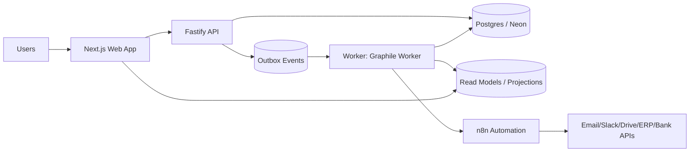

# AFENDA-NEXUS — Product + Architecture Proposal (PAP)

> **Business Truth Engine / “The Machine”**

| Field    | Value                                                                        |
| -------- | ---------------------------------------------------------------------------- |
| Version  | **v0.3 (Final Day-1 Execution Spec + Gap Closure)**                          |
| Date     | 2026-03-04                                                                   |
| Status   | Sprint 2 — complete (backend)                                                |
| Revision | **v0.3-R11 (Sprint 2 — mark-paid, audit queries, OTel, voided GL reversal)** |

---

## 0 — What changed from v0.1 → v0.3-R4

v0.1 was strong, but the gap review identified **missing pillars** that cause rework in ERP/fintech: **Auth**, **Evidence storage**, **Money model**, **Idempotency**, **Observability**, **API versioning**, **Test strategy**.

**v0.3 closes those gaps explicitly** (or marks them intentionally deferred with a note).

### v0.3-R2 → v0.3-R3 changelog

| Area                     | Change                                                                                                     |
| ------------------------ | ---------------------------------------------------------------------------------------------------------- |
| **Monorepo scaffolded**  | All 4 packages + 4 apps created, booted, and type-checking                                                 |
| **DB migrated**          | 24 tables generated and applied (Drizzle)                                                                  |
| **Seed data**            | Demo organization, admin principal, RBAC, CoA, sequences                                                   |
| **Domain splits**        | `db/schema` → 5 domain files; `contracts` → 6 subdirectories / 11 files                                    |
| **pnpm catalog**         | 43 pinned versions; all package.json files use `"catalog:"`                                                |
| **CI gates**             | `check:boundaries` (import direction law), `check:catalog` (version hygiene), `check:all` (unified runner) |
| **Tooling restructured** | `tools/` split into `lib/` (5 shared modules) + `gates/` (2 gate scripts) + `run-gates.mjs`                |
| **OWNERS.md**            | 13 files across packages, subdirectories, and tools                                                        |
| **Tests**                | 4/4 Vitest domain invariant tests passing                                                                  |
| **Services verified**    | web :3000, api :3001 (/healthz, /readyz, /v1), n8n :5678, MinIO :9001                                      |

### v0.3-R3 → v0.3-R4 changelog

| Area                | Change                                                           |
| ------------------- | ---------------------------------------------------------------- |
| **Status audit**    | Precise code-level inventory: implemented vs stub vs not-started |
| **§20 checklist**   | Every Sprint 0 item marked ✅ / ⏳ / ❌ with notes               |
| **Next-phase plan** | Appendix C added: Sprint 0 completion → Sprint 1 execution plan  |
| **Gap analysis**    | Appendix A extended with v0.3-R3 column (scaffold status)        |

### v0.3-R4 → v0.3-R5 changelog

| Area                          | Change                                                                                                                                                                               |
| ----------------------------- | ------------------------------------------------------------------------------------------------------------------------------------------------------------------------------------ |
| **DB client hardened**        | `client.ts` rewritten: pooler vs direct URL selection, strict SSL, `mode:"number"` for all bigint/numeric columns, single exported `db` instance                                     |
| **Migration runner hardened** | `migrate.ts` rewritten: advisory lock, idempotent migrate, structured logging, zero-downtime safe                                                                                    |
| **Seed script idempotent**    | `seed.ts` rewritten: `ON CONFLICT DO NOTHING` everywhere, sequence-safe `setval()` calls, re-runable without error                                                                   |
| **Contract↔DB sync**         | 5 drift issues fixed: InvoiceSchema +3 fields, SupplierSchema +2 fields, PartyRoleSchema +createdAt, IAM OWNERS.md stale entries, `new Date()` in DB code                            |
| **CI gates: 5 → 8**           | 3 new gates: `contract-db-sync` (Zod↔pgTable field parity, 10 entity pairs), `server-clock` (bans `new Date()` in DB-touching code), `owners-lint` (OWNERS.md ↔ filesystem parity) |
| **OWNERS.md drift fixed**     | `shared/OWNERS.md` +sequence.ts, `supplier/OWNERS.md` +supplier.commands.ts                                                                                                          |
| **Tests**                     | 131/131 passing across 4 test files                                                                                                                                                  |

### v0.3-R5 → v0.3-R6 changelog

| Area                     | Change                                                                                                                                                   |
| ------------------------ | -------------------------------------------------------------------------------------------------------------------------------------------------------- |
| **API-first stack**      | `@fastify/swagger` 9.7.0 + `fastify-type-provider-zod` 6.1.0 + `@scalar/fastify-api-reference` 1.48.0 — auto-generates OpenAPI 3.1 spec from Zod schemas |
| **Interactive API docs** | Scalar API reference UI at `/v1/docs` (Kepler theme, dark mode). OpenAPI spec at `/v1/docs/openapi.json`.                                                |
| **Typed routes**         | All evidence + IAM routes refactored to use `ZodTypeProvider` — automatic request validation + response serialization, zero manual `safeParse()`         |
| **Route schemas**        | Every route has `description`, `tags`, `security`, `body`, and `response` schemas — all visible in the interactive docs                                  |
| **pnpm catalog**         | 43 entries (was 40) — added `@fastify/swagger`, `fastify-type-provider-zod`, `@scalar/fastify-api-reference`                                             |

### v0.3-R6 → v0.3-R7 changelog

| Area                      | Change                                                                                                                                                                                                                |
| ------------------------- | --------------------------------------------------------------------------------------------------------------------------------------------------------------------------------------------------------------------- |
| **API route sync audit**  | Created `helpers/responses.ts` — canonical `ERR` codes, `ApiErrorResponseSchema`, `makeSuccessSchema()`, `requireOrg()`, `requireAuth()`. Eliminated duplicate error schemas + copy-pasted guards across route files. |
| **Worker hardened**       | LISTEN/NOTIFY mode (removed `pollInterval`), `noHandleSignals: true`, Pino→Graphile logger adapter, dual-signal shutdown (SIGTERM + SIGINT), heartbeat logging                                                        |
| **Legacy cleanup**        | Removed dead `WORKER_POLL_INTERVAL_MS` + `WORKER_MAX_RETRIES` from `WorkerEnvSchema` — no longer used after LISTEN/NOTIFY switch                                                                                      |
| **Agent skills**          | 3 skills installed: `fastify-best-practices` (Matteo Collina), `openapi-specification-v3.2`, `graphile-worker`                                                                                                        |
| **Sprint 0 status audit** | Full document truth alignment pass — 13 drift items fixed, all stale counts/facts corrected, Appendix C Sprint 0 tasks marked complete                                                                                |
| **Sprint 1 readiness**    | Pre-requisites section added to Appendix C confirming all infrastructure is in place                                                                                                                                  |

### v0.3-R10 → v0.3-R11 changelog

| Area                                | Change                                                                                                                                                                                                                                                                                                                    |
| ----------------------------------- | ------------------------------------------------------------------------------------------------------------------------------------------------------------------------------------------------------------------------------------------------------------------------------------------------------------------------- |
| **Mark Paid command**               | Full lifecycle: `MarkPaidCommandSchema` (contracts), `markPaid()` service (core), `POST /v1/commands/mark-paid` route (api). Permission-gated via `ap.invoice.markpaid`. Status transition `posted → paid` with payment fields (`paidAt`, `paidByPrincipalId`, `paymentReference`). Emits `AP.INVOICE_PAID` outbox event. |
| **DB migration 0001**               | 3 new columns on `invoice` table: `paid_at` (timestamptz), `paid_by_principal_id` (uuid FK → iam_principal), `payment_reference` (text). Migration + journal manually authored (drizzle-kit ESM issue).                                                                                                                   |
| **Invoice entity updated**          | `InvoiceSchema` (contracts), `InvoiceRow` + `mapInvoiceRow` (core), `serialiseInvoice` + response schemas (api) — all updated with 3 payment fields.                                                                                                                                                                      |
| **Audit log query endpoints**       | `listAuditLogs()` + `getAuditTrail()` (core/infra). `GET /v1/audit-logs` (cursor-paginated, filterable by entityType/entityId/action/actor/date range). `GET /v1/audit-logs/:entityType/:entityId` (full entity audit trail).                                                                                             |
| **Audit query contracts**           | `AuditLogFilterSchema` + `AuditLogRowSchema` in `contracts/shared/audit-query.ts`.                                                                                                                                                                                                                                        |
| **SoD: canMarkPaid**                | Permission-only gate in `core/finance/sod.ts` — requires `ap.invoice.markpaid`.                                                                                                                                                                                                                                           |
| **Worker: handle_invoice_paid**     | New handler dispatched via `AP.INVOICE_PAID` outbox event. Log-only stub (future: reconciliation).                                                                                                                                                                                                                        |
| **Worker: voided GL auto-reversal** | `handle-invoice-voided` now queries `journal_entry` for unreversed entries linked to the voided invoice and queues GL reversal jobs via `helpers.withPgClient()`.                                                                                                                                                         |
| **OTel bootstrap**                  | `core/infra/telemetry.ts` — `bootstrapTelemetry()` with dynamic imports (no-op when `OTEL_ENABLED≠true`). Wired into API + worker entry points. devDependencies in core, optionalDependencies in api/worker: `@opentelemetry/api`, `@opentelemetry/sdk-node`, `@opentelemetry/auto-instrumentations-node`.                |
| **Contracts hardened**              | `"invoice.paid"` audit action, `"payment"` entity type, `"AP_INVOICE_ALREADY_PAID"` error code, `apInvoiceMarkPaid` + `auditLogRead` permissions.                                                                                                                                                                         |
| **Test seeds expanded**             | `ap.invoice.markpaid` + `audit.log.read` permissions seeded. Approver role gets both. `markPaidPayload()` factory helper added.                                                                                                                                                                                           |
| **Integration tests**               | 2 new test files: `mark-paid.test.ts` (5 tests: happy path, double-pay 409, invalid status 409, permission 403, status history), `audit-queries.test.ts` (4 tests: list, filter by entityType, filter by action, entity trail, cursor pagination).                                                                        |

### v0.3-R9 → v0.3-R10 changelog

| Area                                  | Change                                                                                                                                                                                                                                                                                             |
| ------------------------------------- | -------------------------------------------------------------------------------------------------------------------------------------------------------------------------------------------------------------------------------------------------------------------------------------------------- |
| **Integration test infrastructure**   | `apps/api/src/__vitest_test__/global-setup.ts` — provisions `afenda_test` database, runs Drizzle migrations, seeds org/principals/RBAC/CoA/supplier/sequences. Raw SQL seeds (no `@afenda/db` import — boundary compliant).                                                                        |
| **Integration test suite (12 tests)** | 8 test files covering all Sprint 1 exit criteria: `invoice-lifecycle` (EC-1), `sod-enforcement` (EC-2), `journal-balance` (EC-3), `idempotency` (EC-4), `audit-completeness` (EC-5), `sequence-gap-free` (EC-6), `cursor-pagination` (EC-7), `tx-atomicity` (EC-8). All run against real Postgres. |
| **Worker handlers complete**          | 5 handlers: `handle-invoice-submitted`, `handle-invoice-approved`, `handle-invoice-rejected`, `handle-invoice-voided`, `handle-journal-posted`. Outbox dispatcher routes all 6 event types.                                                                                                        |
| **BigInt serialization fix**          | `core/infra/idempotency.ts` `stableStringify()` — handles BigInt (from `z.coerce.bigint()` invoice amounts) by converting to `.toString()` instead of throwing. Latent bug exposed by integration tests.                                                                                           |
| **Boundary compliance**               | Removed `@afenda/db` from api dependencies and all source imports. Test seeds use raw SQL via `pg` Client. Gates 8/8.                                                                                                                                                                              |
| **Verification**                      | Build 7/7, Tests 166/166 (154 unit + 12 integration), Gates 8/8                                                                                                                                                                                                                                    |

### v0.3-R8 → v0.3-R9 changelog

| Area                             | Change                                                                                                                                                                                                   |
| -------------------------------- | -------------------------------------------------------------------------------------------------------------------------------------------------------------------------------------------------------- |
| **TOCTOU race fix**              | `invoice.service.ts` approve/reject/void: added `eq(invoice.status, currentStatus)` to UPDATE WHERE clause + `.returning()` row check. Prevents concurrent status changes from silently succeeding.      |
| **Outbox completeness**          | `rejectInvoice` and `voidInvoice` now emit `AP.INVOICE_REJECTED` and `AP.INVOICE_VOIDED` outbox events inside the same transaction. Previously only submit/approve emitted events.                       |
| **Contract cleanup**             | `SubmitInvoiceCommandSchema`: removed server-generated `invoiceNumber` field and unused `documentIds` array. Clients no longer send values the service discards.                                         |
| **GL.JOURNAL_REVERSED dispatch** | Worker `process-outbox-event.ts` now routes `GL.JOURNAL_REVERSED` events. New handler `handle-journal-reversed.ts` registered in task list (5 handlers total).                                           |
| **correlationId alignment**      | GL reverse-entry route now uses `req.body.correlationId` (domain) instead of `req.correlationId` (HTTP header). `idempotencyKey` from body now passed to `reverseJournalEntry` service and stored.       |
| **Audit entityId backfill**      | `submitInvoice` audit entry now gets the generated invoice ID set inside the callback (after INSERT), instead of being undefined.                                                                        |
| **CursorPage shared**            | `CursorPage<T>` moved from `invoice.queries.ts` to `@afenda/contracts/shared/pagination.ts`. GL queries now import from contracts instead of cross-domain AP import. Backward-compatible re-export kept. |
| **Account TOCTOU fix**           | `posting.service.ts`: account existence/active checks moved inside `withAudit` transaction via `GLDomainError` throw pattern.                                                                            |
| **Dead code cleanup**            | Removed unused `ERR` import from `invoices.ts`.                                                                                                                                                          |
| **OWNERS.md governance**         | `finance/OWNERS.md`: PR checklist clarified — "no DB imports" applies to root-level pure files only, not subdomain services. Future Growth filenames updated to match actual Sprint 1 files.             |
| **Test mock fix**                | Invoice service test mocks updated for new `.returning()` chain on UPDATE operations.                                                                                                                    |
| **Verification**                 | Build 7/7, Tests 154/154, Gates 8/8                                                                                                                                                                      |

### v0.3-R7 → v0.3-R8 changelog

| Area                          | Change                                                                                                                                                                                                                   |
| ----------------------------- | ------------------------------------------------------------------------------------------------------------------------------------------------------------------------------------------------------------------------ |
| **Invoice lifecycle service** | `core/finance/ap/invoice.service.ts` — full state machine (submit, approve, reject, void) with TRANSITIONS map, SoD enforcement, gap-free INV numbering, outbox events, status history. Discriminated union result type. |
| **Invoice query service**     | `core/finance/ap/invoice.queries.ts` — cursor-paginated list (status filter), get-by-id, status history queries                                                                                                          |
| **GL posting service**        | `core/finance/gl/posting.service.ts` — journal posting with balance validation, account existence/active checks, gap-free JE numbering, outbox events. Reversal creates new entry with swapped debit↔credit.            |
| **GL query service**          | `core/finance/gl/gl.queries.ts` — journal entry list/detail (with lines), account list, real-time trial balance aggregate                                                                                                |
| **API routes: Invoices**      | `apps/api/src/routes/invoices.ts` — 7 endpoints: submit, approve, reject, void (commands), list, get-by-id, history (queries). ZodTypeProvider, rate-limited commands.                                                   |
| **API routes: GL**            | `apps/api/src/routes/gl.ts` — 6 endpoints: post-to-gl, reverse-entry (commands), journal entries, journal entry detail, accounts, trial balance (queries).                                                               |
| **Worker handlers**           | 3 new task handlers: `handle-invoice-submitted`, `handle-invoice-approved`, `handle-journal-posted`. Outbox dispatch switch activated in `process-outbox-event.ts`.                                                      |
| **Unit tests**                | 22 new tests: 14 for invoice service (all lifecycle ops + SoD + transitions), 8 for GL posting service (post + reverse + guards). Total: 153+ across 6 test files.                                                       |
| **OWNERS.md**                 | 2 new: `core/finance/ap/OWNERS.md`, `core/finance/gl/OWNERS.md` — document state machine rules, dependency whitelists, file inventories                                                                                  |

---

## 1 — Vision & Positioning

We are **not building features**. We are building **Truth**.

- UI is a **projection** of truth
- Workflows are **operators** on truth
- Integrations are **adapters** to/from truth
- Every financial fact is **reproducible, auditable, explainable**

### Benchmarks (inspiration, not imitation)

| System                           | What we borrow                                                     | What we avoid                            |
| -------------------------------- | ------------------------------------------------------------------ | ---------------------------------------- |
| Odoo                             | modular extensibility, speed of CRUD                               | fragile upgrades, heavy coupling         |
| SAP S/4                          | governance, SoD, audit discipline                                  | complexity ceiling                       |
| NetSuite                         | SaaS polish + UX maturity                                          | vendor lock + opaque customization       |
| Coupa / Ariba / Tipalti / Taulia | supplier/AP collaboration patterns                                 | feature bloat outside core scope         |
| n8n / Zapier / Make              | workflow velocity + integrations                                   | logic drift into visual workflows        |
| **Stripe**                       | API design: idempotency keys, error shapes, versioning, pagination | over-abstraction for non-payment domains |
| **Xero**                         | journal engine design, clean accounting API, bank feed model       | closed ecosystem, limited extensibility  |

---

## 2 — Product Scope (Day-1)

### 2.1 Personas

| Persona                     | Core need                                        |
| --------------------------- | ------------------------------------------------ |
| Finance Operator (AP/AR/GL) | correctness, speed, audit trail                  |
| Approver                    | approve/reject with evidence                     |
| Supplier user               | invoice submission + payment status transparency |
| Admin                       | organization/company setup, roles, controls      |

### 2.2 Day-1 thin slice (non-negotiable, reordered for execution realism)

This keeps the original intent but **locks the build order** to reduce risk.

**Sprint 0 (foundation)**

1. **Auth + org resolution + RBAC** (must exist before any command API)
2. **Evidence storage** (uploads + linking model)
3. **Money model** (bigint minor units + currency codes)

**Sprint 1 (truth slice)**  
4. **Invoice submission** (manual + upload; email ingest via n8n)  
5. **Approval workflow** (single-step approve/reject)  
6. **Posting to GL** (minimum double-entry, single functional currency first)

**Sprint 2 (operational slice)**  
7. **Audit log + evidence trail** (fully queryable)  
8. **Payment status tracking** (manual status first; bank sync later)  
9. **n8n baseline** (notifications + connectors; never truth)

> Note: Multi-org **schema is org-aware Day-1** (`org_id` everywhere), but **DB-enforced RLS can be Sprint 2** if it slows Sprint 0/1.

### 2.3 Explicit Day-1 non-goals

- Full procurement, HR, manufacturing, consolidation
- Complex BPMN
- Multi-region active-active
- 3-way match (PO/GRN/Invoice) _(design hooks only; see Appendix B)_

---

## 3 — Architecture Principles

### A — Truth core in code; automation at the edges

- Core truth (posting, approvals, SoD, audit) is deterministic code + tests
- n8n is **edges only**: email, Slack, connectors, scheduled syncs

> Why: n8n accelerates integrations, but finance workflows require replayability + evidence.

### B — Event-first inside; workflow-first outside

- Inside: outbox → worker → projections
- Outside: n8n consumes webhooks/events

### C — No magic customization

Every extension must pass through:

- versioned API contracts
- event contracts
- migration discipline
- capability registry

---

## 4 — System Architecture (Day-1)

### 4.1 High-level diagram



### 4.2 Component responsibilities

**Web (Next.js)**

- UI reads projections and sends **commands** via API
- UI never invents truth

**API (Fastify)**

- **Command API** (writes): `SubmitInvoice`, `ApproveInvoice`, `PostToGL`, `MarkPaid`, `AttachEvidence`
- **Query API** (reads): list/search from projections

**DB (Postgres/Neon)**

- Truth tables: invoice, approval, journal, audit, document/evidence, idempotency, outbox
- Projection tables: dashboards, lists, KPI decks

**Worker (Graphile Worker)**

- projections, notifications, doc pipeline triggers, integration emitters
- all consumers are **idempotent**
- uses **LISTEN/NOTIFY** for sub-3ms job pickup (polling is automatic fallback only)

**n8n**

- glue workflows only (email ingest, notifications, scheduled syncs)
- strict boundary: cannot define accounting truth

### 4.3 Data contracts (minimum executable definition)

**Command contract**

- must include `idempotencyKey`
- must include `correlationId`
- server stamps `actorPrincipalId` from session (never trusted from payload)

**Event contract (outbox)**

- `type`, `version`, `orgId`, `correlationId`, `occurredAt`, `payload`
- events are immutable once written

**Query contract**

- always returns projection DTOs in camelCase
- paginated via **cursor-based pagination** (not offset)
- standard envelope: `{ data: T[], cursor: string | null, hasMore: boolean }`

**Error contract (Stripe-inspired)**

- all errors return: `{ error: { code: string, message: string, details?: object } }`
- HTTP status codes: 400 (validation), 401 (unauthenticated), 403 (forbidden + "why denied"), 404, 409 (conflict/idempotency), 422 (domain rule violation), 500
- `correlationId` is always present in error responses for tracing

### 4.4 Domain entities (minimum Day-1 models)

**Supplier**

- `supplier(id, org_id, name, tax_id, contact_email, status, onboarded_by, onboarded_at, created_at, updated_at)`
- statuses: `draft → active → suspended`

**Invoice**

- `invoice(id, org_id, supplier_id, invoice_number, amount_minor, currency_code, status, submitted_by, submitted_at, due_date, created_at)`
- statuses: `submitted → approved → posted → paid` (also: `rejected`, `void`)

**Chart of Accounts**

- `account(id, org_id, code, name, type, is_active, created_at)`
- account types: `asset`, `liability`, `equity`, `revenue`, `expense`
- Day-1: flat CoA (no hierarchy); tree structure deferred

**Journal entry**

- `journal_entry(id, org_id, entry_number, posted_at, memo, posted_by, correlation_id, created_at)`
- `journal_line(id, journal_entry_id, account_id, debit_minor, credit_minor, currency_code)`
- invariant: `Σ debit_minor == Σ credit_minor` per entry

**Sequence numbering**

- `sequence(id, org_id, entity_type, prefix, next_value)`
- human-readable, sequential, gap-free numbers for invoices + journal entries
- generated inside the posting transaction (not pre-allocated)
- format examples: `INV-2026-0001`, `JE-2026-0001`

---

## 5 — Security Model (Auth + AuthZ + Org Context)

### 5.1 Authentication (AuthN) — pinned decision

**NextAuth (`next-auth`) v4.24.13** for Day-1 stability.  
Session strategy: **JWT** — the API validates tokens independently via `jose` + HKDF key derivation from `NEXTAUTH_SECRET`. This avoids per-request DB round-trips and allows the API server to authenticate without sharing a session store.

> NOTE: Auth.js v5 is intentionally deferred (migration/beta churn).

### 5.2 Organization resolution (canonical rule)

Canonical organization resolution order:

1. Subdomain: `{org}.afenda.app`
2. Header fallback (internal only): `x-org-id`
3. Never from body payloads

**Request context (single source of truth)**

```ts
{
  orgId,
  principalId,
  roles: string[],
  permissions: string[],
  correlationId
}
```

### 5.3 Authorization (AuthZ) — RBAC + SoD hooks

Minimum RBAC tables:

- `iam_principal`
- `iam_role`
- `iam_permission`
- `iam_principal_role`
- `iam_role_permission`
- `iam_party_role` (principal ↔ organization/workspace)

**Permission naming (to avoid entropy)**

- `ap.invoice.submit`
- `ap.invoice.approve`
- `ap.invoice.markpaid`
- `gl.journal.post`
- `evidence.attach`
- `admin.org.manage`
- `supplier.onboard`
- `audit.log.read`

**SoD policy layer** lives in `packages/core` and is executed _inside_ command handlers.

### 5.4 DB isolation (multi-org)

- Day-1: `org_id` on every table
- Sprint 2: enable Postgres RLS policies (DB-enforced)

### 5.5 Rate limiting

External-facing API (supplier portal) requires rate limiting from Day-1.

- Use `@fastify/rate-limit` plugin
- Default: 100 requests/min per IP for unauthenticated, 300/min per user for authenticated
- Commands (writes): stricter limit (30/min per user)
- Presigned URL generation: 10/min per user

---

## 6 — Evidence + Document Storage

AP is document-heavy; evidence is Day-1 infrastructure.

### 6.1 Storage decision (Day-1)

Use **S3-compatible object storage** (Cloudflare R2 / AWS S3) via AWS SDK v3:

- `@aws-sdk/client-s3` **v3.750.0**

### 6.2 Upload flow (Day-1)

1. UI requests presigned upload URL from API
2. UI uploads directly to object storage
3. UI calls `AttachEvidence` with `{ documentId, entityType, entityId, label? }`

### 6.3 Schema (minimum)

- `document(id, org_id, object_key, sha256, mime, size, uploaded_by, uploaded_at)`
- `evidence(id, org_id, entity_type, entity_id, document_id, label, created_at)`

**Audit requirement:** store SHA-256 to prove integrity.

> NOTE (purposefully omitted Day-1): malware scanning pipeline. Add later if supplier uploads are public-facing.

---

## 7 — Money + Currency Model

**No floats. Ever.**

### 7.1 Canonical money type

- `amount_minor: bigint` (cents/pips)
- `currency_code: string` (ISO 4217)
- Legal entity has `functional_currency_code`

### 7.2 Posting invariants (minimum)

- Every journal entry balances: `Σ debits == Σ credits`
- All posting operations are atomic DB transactions:
  - wrapped in `db.transaction()` inside `packages/core`
  - never in route handlers

### 7.3 Timestamp model

**All timestamps stored as UTC (`timestamptz` in Postgres).** No exceptions.

- DB columns: `timestamptz` (never `timestamp without time zone`)
- API responses: ISO 8601 with `Z` suffix (`2026-03-04T12:00:00.000Z`)
- Display: converted to user's timezone in UI only
- Audit trail timestamps are **immutable** — never updated after creation

### 7.4 Immutability policy (truth tables)

**Truth tables are append-only. No UPDATEs. No DELETEs.**

Applies to: `journal_entry`, `journal_line`, `audit_log`, `outbox_event`

- Corrections are made via **reversal entries** (new journal entry that offsets the original), never by editing
- Status changes on invoices/approvals are **new rows in a status history table**, not column updates
- Projection tables (read models) may be updated/rebuilt freely

> This is a regulatory/legal requirement in most jurisdictions for financial records.

---

## 8 — Reliability: Idempotency, Retries, DLQ

### 8.1 Command idempotency (hard rule)

Every command:

- accepts `idempotencyKey` (client supplied)
- stores it in `idempotency` (unique on `org_id + command + key`)
- duplicates return the original result

**Wire protocol standard**

- Client sends header: `Idempotency-Key: <uuid>`
- API also supports body field for internal calls, but header is canonical.

**Minimum schema**

- `idempotency(org_id, command, key, request_hash, result_ref, created_at)`

### 8.2 Worker retries + dead-letter

- Worker retries with exponential backoff
- After N failed attempts → `dead_letter_job` (manual review)
- Every handler idempotent (safe re-execution)

> NOTE: N value is set in config (default 10), not hard-coded in code.

---

## 9 — Observability

### 9.1 Correlation ID standard

- Every request has a `correlationId`
- Propagation path: API → outbox event → worker → n8n calls

**Wire standard**

- Request header: `X-Correlation-Id` (generated if absent)
- Outbox stores correlationId

### 9.2 OpenTelemetry

Day-1 baseline: correlation ID propagation via `X-Correlation-Id` header (implemented Sprint 0).
OpenTelemetry SDK implemented in Sprint 2 (R11): `core/infra/telemetry.ts` — `bootstrapTelemetry()` with `OTEL_ENABLED` guard (no-op when disabled). Wired into API + worker entry points. Packages (devDependencies in core, optionalDependencies in api/worker):

- `@opentelemetry/api` **1.9.0**
- `@opentelemetry/sdk-node` **0.212.0**
- `@opentelemetry/auto-instrumentations-node` **0.70.1**

Sprint 2 dashboards/alerts:

- outbox backlog depth
- worker lag (time since oldest unprocessed job)
- failed jobs count
- posting latency p50/p95
- approval queue depth

### 9.3 Health checks

**API** exposes:

- `GET /healthz` — returns 200 if process is alive
- `GET /readyz` — returns 200 if DB connection + migrations are current

**Worker** exposes (or logs):

- heartbeat metric: last job polled timestamp
- if no poll in >60s, alert

---

## 10 — API Versioning

URL versioning (Day-1): `/v1/...`

- Commands: `POST /v1/commands/submit-invoice`
- Queries: `GET /v1/invoices?...`

Breaking change policy:

- breaking changes require `/v2`
- `/v1` stays stable; deprecations are additive only

---

## 11 — n8n Escalation Plan (“n8n-first, then harden”)

### Phase 0 — Day 1 → Day 14

Use n8n for:

- inbound invoice email → call API `SubmitInvoice`
- approval notification → Slack/email
- scheduled syncs (FX rates, bank statements, vendor master pulls)

Guardrail rule:

> n8n can orchestrate, but cannot define accounting truth.

**Webhook security (mandatory)**

- Every n8n webhook URL must be protected by HMAC signature verification or a shared secret in a query parameter
- n8n admin UI must never be exposed publicly — isolate behind VPN or internal network
- Webhook URLs should include a non-guessable path segment (e.g., `/webhooks/{random-token}/submit-invoice`)

### Phase 1 — Day 15 → Day 60

- approvals, posting, SoD checks become code workflows executed via worker
- n8n stays for integrations + notifications

### Phase 2 — Optional: Temporal

- only if worker + outbox no longer fits
- do not add preemptively

---

## 12 — Tech Stack Lock (pinned versions, Day-1)

All versions verified as of **2026-03-04**.

### 12.1 Runtime + Monorepo

| Package    | Version | Role                   |
| ---------- | ------- | ---------------------- |
| Node.js    | 24 LTS  | Runtime                |
| pnpm       | 10.30.3 | Package manager        |
| Turborepo  | 2.8.12  | Monorepo orchestration |
| TypeScript | 5.9.3   | Language               |

### 12.2 Web

| Package      | Version  | Notes                    |
| ------------ | -------- | ------------------------ |
| Next.js      | 16.1.6   | App Router               |
| React        | 19.2.4   | + react-dom same major   |
| Tailwind CSS | 4.2.1    | Utility-first styling    |
| shadcn/ui    | (manual) | follow Tailwind v4 guide |

> NOTE: Declare React deps for ecosystem/tooling compatibility.

### 12.3 Auth

| Package   | Version | Notes        |
| --------- | ------- | ------------ |
| next-auth | 4.24.13 | JWT sessions |

### 12.4 API + Domain

| Package                       | Version | Role                                    |
| ----------------------------- | ------- | --------------------------------------- |
| Fastify                       | 5.7.4   | HTTP framework                          |
| @fastify/rate-limit           | 10.3.0  | Rate limiting                           |
| @fastify/cors                 | 11.2.0  | CORS policy                             |
| @fastify/swagger              | 9.7.0   | OpenAPI 3.1 spec generation             |
| @scalar/fastify-api-reference | 1.48.0  | Interactive API docs UI                 |
| fastify-type-provider-zod     | 6.1.0   | Zod schema → route validation + OpenAPI |
| Zod                           | 4.3.6   | Schema validation                       |
| Pino                          | 10.3.1  | Logging                                 |

### 12.5 Data + Jobs

| Package         | Version    | Notes                           |
| --------------- | ---------- | ------------------------------- |
| PostgreSQL      | 17 (major) | Neon supports 14–17; 18 preview |
| Drizzle ORM     | 0.45.1     | Type-safe SQL                   |
| drizzle-kit     | 0.31.9     | Migrations + introspection      |
| Graphile Worker | 0.16.6     | Postgres-native jobs            |

### 12.6 Evidence Storage

| Package            | Version | Notes          |
| ------------------ | ------- | -------------- |
| @aws-sdk/client-s3 | 3.750.0 | presigned URLs |

### 12.7 Observability

| Package                                   | Version | Notes                      |
| ----------------------------------------- | ------- | -------------------------- |
| @opentelemetry/api                        | 1.9.0   | trace API (Sprint 2)       |
| @opentelemetry/sdk-node                   | 0.212.0 | node SDK (Sprint 2)        |
| @opentelemetry/auto-instrumentations-node | 0.70.1  | auto-instrument (Sprint 2) |

### 12.8 Workflow Automation

| Package    | Version | Role           | Notes           |
| ---------- | ------- | -------------- | --------------- |
| n8n (prod) | 2.9.4   | edge workflows | stable track    |
| n8n (dev)  | 2.10.2  | dev/staging    | beta track only |

Security note:

- keep updated
- never expose admin publicly
- isolate behind VPN / internal network when possible

### 12.9 Testing

| Package | Version | Role               |
| ------- | ------- | ------------------ |
| Vitest  | 4.0.18  | unit + integration |

### 12.10 Dev Environment + Config

| Package                 | Version       | Role                   |
| ----------------------- | ------------- | ---------------------- |
| dotenv                  | 17.3.1        | env loading (dev only) |
| Docker + Docker Compose | latest stable | local Postgres + n8n   |

- Env vars validated at startup via Zod schema (fail-fast, not silent fallback)
- `.env.example` committed; `.env` gitignored
- Secrets in production via platform env (Vercel, Railway, etc.) — never in code

---

## 13 — Neon-Specific Operational Rules

Day-1 rules:

- API uses Neon **pooler** connection string
- Worker uses **direct** connection string
- Validate latency/pooling early

> NOTE: Don’t rely on assumptions. Measure with a simple “job poll + transaction” test in Sprint 0.

---

## 13.1 — Deployment Targets (Day-1)

| Component      | Target                     | Notes                                  |
| -------------- | -------------------------- | -------------------------------------- |
| Web (Next.js)  | Vercel                     | zero-config SSR, preview deploys       |
| API (Fastify)  | Railway / Fly.io           | long-running process, not serverless   |
| Worker         | Railway / Fly.io (same)    | persistent process, LISTEN/NOTIFY mode |
| n8n            | Docker on Railway / Fly.io | self-hosted, behind internal network   |
| Postgres       | Neon                       | serverless Postgres                    |
| Object storage | Cloudflare R2 / AWS S3     | evidence documents                     |

> NOTE: API and Worker are **long-running Node.js processes** — do not deploy to serverless/Lambda. Graphile Worker requires persistent connections and uses PostgreSQL LISTEN/NOTIFY for near-instant job pickup (polling is an automatic fallback).

---

## 13.2 — Local Development Environment

Developers must be able to run the full stack locally with one command.

**`docker-compose.dev.yml`** provides:

- Postgres 17 (local, no cold-start latency)
- n8n (local instance with workflow imports)
- (optional) MinIO as S3-compatible local storage

**Bootstrap sequence:**

```bash
pnpm install
docker compose -f docker-compose.dev.yml up -d
pnpm db:migrate
pnpm dev
```

> Seed script (`pnpm db:seed`) creates: test organization, admin principal, sample CoA, sample supplier.

---

## 14 — Repo Layout

```text
afenda-nexus/
├── apps/
│   ├── web/              # Next.js UI
│   ├── api/              # Fastify command + query API
│   ├── worker/           # Graphile Worker runners
│   └── n8n/              # Docker Compose config + workflow exports
├── packages/
│   ├── contracts/        # Zod schemas + shared types
│   │   └── src/
│   │       ├── shared/   # headers, envelope, money, pagination, outbox
│   │       ├── iam/      # organization, role, principal, permission schemas
│   │       ├── supplier/ # supplier status + CRUD schemas
│   │       ├── invoice/  # invoice status, entity, command schemas
│   │       ├── gl/       # account type, journal line, GL commands
│   │       ├── document/ # evidence / attachment schemas
│   │       └── index.ts  # barrel (re-exports only, < 60 lines)
│   ├── db/               # Drizzle schema + migrations + seed
│   │   └── src/schema/
│   │       ├── iam.ts      # organization, principal, role, permission tables
│   │       ├── supplier.ts # supplier table
│   │       ├── document.ts # document, evidence tables
│   │       ├── finance.ts  # account, invoice, journal tables
│   │       ├── infra.ts    # outbox, idempotency, audit, sequence
│   │       └── index.ts    # barrel (re-exports only, < 60 lines)
│   ├── core/             # Domain services: posting, approvals, SoD, money
│   └── ui/               # Design system (shadcn/ui)
├── tools/
│   ├── lib/                   # Shared utilities for CI gates
│   │   ├── ansi.mjs           # Terminal color helpers
│   │   ├── walk.mjs           # Recursive TS file walker
│   │   ├── imports.mjs        # Import-statement extractor + bare-package normalizer
│   │   ├── workspace.mjs      # pnpm-workspace.yaml loader + pkg.json discovery
│   │   └── reporter.mjs       # Grouped violation reporter + summary table
│   ├── gates/                 # Individual CI gate scripts (one concern per file)
│   │   ├── boundaries.mjs     # Import Direction Law enforcement
│   │   ├── catalog.mjs        # pnpm catalog version hygiene
│   │   ├── test-location.mjs  # Test files must live in __vitest_test__/ directories
│   │   ├── schema-invariants.mjs  # DB schema rules: timestamptz, mode:"number", relations
│   │   ├── migration-lint.mjs # SQL migration hygiene (no DROP TABLE, no data manipulation)
│   │   ├── contract-db-sync.mjs   # Zod schema ↔ pgTable column parity (10 entity pairs)
│   │   ├── server-clock.mjs   # Bans new Date() in DB-touching code (use sql`now()`)
│   │   └── owners-lint.mjs    # OWNERS.md Files table ↔ filesystem parity
│   ├── run-gates.mjs          # Unified runner — all gates, single exit code
│   └── OWNERS.md
├── docker-compose.dev.yml
├── turbo.json
├── pnpm-workspace.yaml
├── tsconfig.base.json
├── .env.example
└── PROJECT.md
```

### 14.1 — Import Direction Law (hard rule)

```text
contracts  →  zod only         (no monorepo deps)
db         →  drizzle-orm + pg + contracts (*Values only — no Zod schemas)
core       →  contracts + db   (the ONLY join point)
ui         →  contracts only
api        →  contracts + core (never db directly)
web        →  contracts + ui   (never db, never core)
worker     →  contracts + core + db
```

> **`db → contracts` is intentionally constrained:** `@afenda/db` may import
> `*Values` const tuples (e.g. `InvoiceStatusValues`) to feed `pgEnum()` —
> these are plain `as const` string arrays with zero Zod runtime. Importing
> Zod schemas or any runtime construct from contracts into db is still
> forbidden (enforced by the `FORBIDDEN_EXTERNALS["packages/db"] = ["zod"]`
> rule). See `contracts/OWNERS.md §3` for the canonical documentation.

Enforced by `pnpm check:boundaries` (runs `tools/gates/boundaries.mjs`).
CI must run this on every PR. Violations exit non-zero.

Additional hard rules:

- **No barrel file > 60 lines.** If it grows, split into submodule re-exports.
- **OWNERS.md in every package + subdirectory** — documents what belongs and what doesn't.
- **No Zod inside `@afenda/db`** — schema shapes live in contracts.
- **No drizzle-orm inside `@afenda/contracts`** — contracts are runtime-independent.

### 14.2 — pnpm Version Catalog (hard rule)

`pnpm-workspace.yaml` contains a `catalog:` section — the **single source of truth** for dependency versions across the monorepo. All `package.json` files reference `"catalog:"` instead of hardcoded version strings.

Rules:

- If a dependency is used by ≥2 packages, it **must** be in the catalog and every occurrence **must** use `"catalog:"`.
- Version mismatches across packages are violations.
- `"catalog:"` references to deps not in the catalog section are violations.

Enforced by `pnpm check:catalog` (runs `tools/gates/catalog.mjs`).

AI-agent productivity rule:

- contracts in one place → `packages/contracts/src/<domain>/`
- db schema in one place → `packages/db/src/schema/<domain>.ts`
- core services in one place → `packages/core/src/`
- UI consumes contracts only → never imports db or core

---

## 15 — Naming Conventions (zero debugging hell policy)

| Layer                 | Convention | Example  |
| --------------------- | ---------- | -------- |
| DB columns            | snake_case | `org_id` |
| TS / JSON / contracts | camelCase  | `orgId`  |

Rules:

- mapping occurs **only** at db/repository boundary
- handlers and UI never reference snake_case
- CI gate: API responses must not contain `_` keys

---

## 16 — Testing Strategy

| Layer             | Covers                           | Location             |
| ----------------- | -------------------------------- | -------------------- |
| Domain invariants | debits=credits, idempotency, SoD | `packages/core`      |
| Integration tests | API → DB on real Postgres        | `apps/api`           |
| Contract tests    | Zod ↔ API parity                | `packages/contracts` |
| Workflow tests    | n8n flows via staging webhooks   | `apps/n8n`           |

Coverage rule:

- posting + approval invariants: near-complete (practically 100%)

---

## 17 — Best Practices (vs Legacy ERPs)

Truth-first data model:

- write model: append-only facts + approvals + evidence
- read model: projection tables for speed

Security by construction:

- org isolation (RLS later if needed)
- SoD policies testable
- “why denied?” endpoint

Upgrade-safe extensibility:

- contracts → events → migrations → capability registry

---

## 18 — IDE + AI-Agent Operating Model

Schema is truth workflow:

1. contracts
2. db schema + migration
3. core domain service
4. API route
5. UI
6. tests

CI guardrails (8 gates, all enforced):

- **`pnpm check:boundaries`** — import direction law: enforces package dependency graph (exit 1 on violation)
- **`pnpm check:catalog`** — pnpm catalog version hygiene: no hardcoded versions, no phantom refs (exit 1 on violation)
- **`pnpm check:test-location`** — test files must live in `__vitest_test__/` directories, not alongside source
- **`pnpm check:schema-invariants`** — DB schema rules: all timestamps use `timestamptz`, all bigint/numeric use `mode:"number"`, relations file exists
- **`pnpm check:migration-lint`** — SQL migration hygiene: no `DROP TABLE`, no data manipulation in migrations
- **`pnpm check:contract-db-sync`** — Zod contract schema ↔ pgTable column parity across 10 entity pairs (configurable exclusions for intentional divergences)
- **`pnpm check:server-clock`** — bans `new Date()` in files that import `drizzle-orm` or `@afenda/db` (use `sql\`now()\``instead; line-level opt-out via`// gate:allow-js-date`)
- **`pnpm check:owners-lint`** — validates OWNERS.md Files tables match actual `.ts` files on disk (catches phantom & unlisted entries)
- **`pnpm check:all`** — unified runner: executes all 8 gates, exits 1 on any failure

### 18.1 — API-First Development Model

The API is the **primary contract surface**. All clients (web, mobile, n8n, external integrations) consume the same versioned HTTP API.

**Stack:**

- `fastify-type-provider-zod` — routes declare Zod schemas for `body`, `querystring`, `params`, `headers`, and `response`. Fastify validates automatically (no manual `safeParse()`).
- `@fastify/swagger` — generates OpenAPI 3.1 spec from route schemas at startup. Zero manual YAML/JSON maintenance.
- `@scalar/fastify-api-reference` — interactive API explorer at `/v1/docs` with try-it-out, code samples, dark mode.

**Endpoints:**

- `GET /v1/docs` — interactive API reference (Scalar UI)
- `GET /v1/docs/openapi.json` — machine-readable OpenAPI 3.1 spec

**Workflow:**

1. Define Zod schemas in `@afenda/contracts`
2. Reference them in route `schema` options via the Zod type provider
3. OpenAPI spec is generated automatically — always in sync with code
4. Import the spec into Postman, Bruno, Insomnia, or any OpenAPI-compatible tool
5. SDK generation is possible via `openapi-typescript` or `openapi-fetch`

**Why not Kong?** AFENDA has a single Fastify API server. Rate limiting, CORS, and auth are handled in-process. Kong adds operational overhead with no Day-1 benefit. Re-evaluate when the project grows to multiple services.

**Why not Postman directly?** The OpenAPI spec _is_ the Postman collection. Import `/v1/docs/openapi.json` into Postman, Bruno, or any tool. No vendor lock-in.

---

## 19 — Success Metrics

Day-1 is successful when:

| Metric                                                    | Verification                               |
| --------------------------------------------------------- | ------------------------------------------ |
| Invoice → Approved → Posted fully traceable with evidence | End-to-end test + audit log query          |
| Every UI screen backed by a contract + projection         | No ad-hoc data fetching in components      |
| n8n workflows exist only at edges                         | Workflow audit: no business logic in n8n   |
| New module addable without touching 20 files              | Add a test module; count file changes      |
| Auth + org context on every request                       | Middleware test; no unauthenticated routes |
| Every command is idempotent                               | Replay tests pass without side effects     |
| Every mutation produces audit log with `correlationId`    | Audit query coverage test                  |
| Truth tables have zero UPDATE/DELETE operations           | DB trigger or CI check                     |
| All timestamps are UTC `timestamptz`                      | Schema lint                                |
| Local dev bootstraps in < 5 minutes                       | Onboarding test                            |

---

## 20 — Day-1 Execution Checklist (with status)

Legend: ✅ done — ⏳ partially done / stub — ❌ not started

### Sprint 0 (foundation)

| #    | Item                                                  | Status | Notes                                                                                                                                                                                                                                                                             |
| ---- | ----------------------------------------------------- | ------ | --------------------------------------------------------------------------------------------------------------------------------------------------------------------------------------------------------------------------------------------------------------------------------- |
| 0.1  | Bootstrap monorepo + pinned versions (§12)            | ✅     | pnpm workspaces, Turborepo, 43-entry catalog, all type-checking                                                                                                                                                                                                                   |
| 0.2  | `docker-compose.dev.yml` (Postgres + n8n + MinIO)     | ✅     | Postgres 17.9 :5433, n8n 2.9.4 :5678, MinIO :9000/9001                                                                                                                                                                                                                            |
| 0.3  | Env validation (Zod schema for all env vars)          | ✅     | `validateEnv(ApiEnvSchema)` / `WorkerEnvSchema` called at startup in all three apps                                                                                                                                                                                               |
| 0.4  | Auth + org resolution middleware (§5)                 | ✅     | NextAuth v4 credentials (JWT strategy), Bearer JWE decode via jose+HKDF, `/auth/signin` page, org resolution subdomain/header/`"demo"` fallback                                                                                                                                   |
| 0.5  | RBAC tables + permission seed                         | ✅     | 10 IAM tables (party model + RBAC after ADR-0003), seed creates admin role + 8 permissions (`ap.invoice.submit`, `ap.invoice.approve`, `ap.invoice.markpaid`, `gl.journal.post`, `evidence.attach`, `admin.org.manage`, `supplier.onboard`, `audit.log.read`) + user-role binding |
| 0.6  | Evidence storage + document/evidence tables (§6)      | ✅     | `POST /v1/evidence/presign` (S3 presigned URL), `POST /v1/documents` (register doc), `POST /v1/commands/attach-evidence` — all three endpoints wired with rate limits + audit log                                                                                                 |
| 0.7  | Money model + shared money utils (§7)                 | ✅     | `core/money.ts` (fromMajorUnits, addMoney), `contracts/shared/money.ts` (MoneySchema)                                                                                                                                                                                             |
| 0.8  | Timestamp + immutability rules in schema (§7.3, §7.4) | ✅     | All columns `timestamptz`, truth tables append-only by design                                                                                                                                                                                                                     |
| 0.9  | Chart of Accounts + supplier schema (§4.4)            | ✅     | DB tables + seed (6-account CoA). Contract schemas for both.                                                                                                                                                                                                                      |
| 0.10 | Sequence numbering infrastructure (§4.4)              | ✅     | `sequence` table + seed (`INV-2026`, `JE-2026`). Runtime `nextNumber()` service implemented in `core/infra/numbering.ts` (OrgId branded).                                                                                                                                         |
| 0.11 | Outbox + idempotency tables (§8)                      | ✅     | `outbox_event`, `idempotency`, `dead_letter_job` tables migrated                                                                                                                                                                                                                  |
| 0.12 | Observability baseline + correlation propagation (§9) | ✅     | Correlation ID hook in API (generates UUID, propagates via header). OpenTelemetry SDK implemented in Sprint 2 (R11): `core/infra/telemetry.ts` — `bootstrapTelemetry()` with `OTEL_ENABLED` guard.                                                                                |
| 0.13 | Health check endpoints (§9.3)                         | ✅     | `/healthz` 200. `/readyz` queries `drizzle.__drizzle_migrations` — returns DB latency + last migration hash.                                                                                                                                                                      |
| 0.14 | Rate limiting middleware (§5.5)                       | ✅     | 100 req/min unauth (IP-keyed), 300 req/min auth (principalId-keyed); per-route overrides: presign 10/min, commands 30/min                                                                                                                                                         |

**Sprint 0 completion: 14/14 complete (OTel SDK implemented in Sprint 2 R11; correlation ID propagation was Day-1 baseline)**

### Sprint 1 (truth slice)

| #   | Item                                                      | Status | Notes                                                                                                                                                                                                                                                         |
| --- | --------------------------------------------------------- | ------ | ------------------------------------------------------------------------------------------------------------------------------------------------------------------------------------------------------------------------------------------------------------- |
| 1.1 | SubmitInvoice command + projections + sequence generation | ✅     | `core/finance/ap/invoice.service.ts` (submitInvoice), `api/routes/invoices.ts` (POST /v1/commands/submit-invoice), worker handler (handle-invoice-submitted). Gap-free INV numbering, outbox event, status history. 14 unit tests + integration (EC-1, EC-6). |
| 1.2 | ApproveInvoice command + SoD check + projections          | ✅     | `core/finance/ap/invoice.service.ts` (approveInvoice), SoD enforcement via `canApproveInvoice`, outbox event, worker handler (handle-invoice-approved). Integration (EC-1, EC-2).                                                                             |
| 1.3 | PostToGL command + journal invariant tests                | ✅     | `core/finance/gl/posting.service.ts` (postToGL, reverseJournalEntry), `api/routes/gl.ts` (POST /v1/commands/post-to-gl, /reverse-entry), worker handler (handle-journal-posted). Balance validation, account checks. 8 unit tests + integration (EC-3).       |
| 1.4 | AttachEvidence command + presigned URL flow               | ✅     | S3 service wired, `POST /v1/evidence/presign` + `POST /v1/documents` + `POST /v1/commands/attach-evidence` implemented                                                                                                                                        |
| 1.5 | Error response contract validation (§4.3)                 | ✅     | Canonical `ApiErrorResponseSchema` + `ERR` codes in `helpers/responses.ts`. Stripe-style error envelope in global error handler.                                                                                                                              |
| 1.6 | Cursor-based pagination on query endpoints                | ✅     | Implemented in `invoice.queries.ts` (GET /v1/invoices) and `gl.queries.ts` (GET /v1/gl/journal-entries, /v1/gl/accounts). Base64url cursor, limit+1 fetch pattern. Integration (EC-7).                                                                        |

**Sprint 1 completion: 9/9 done. All exit criteria verified by integration tests. Build 7/7, Tests 176/176 (154 unit + 22 integration), Gates 8/8.**

### Sprint 2 (operational slice — backend-only, UI deferred to Sprint 3)

| #   | Item                                                                        | Status | Notes                                                                                                                                                                                                                                                                                                                                                  |
| --- | --------------------------------------------------------------------------- | ------ | ------------------------------------------------------------------------------------------------------------------------------------------------------------------------------------------------------------------------------------------------------------------------------------------------------------------------------------------------------ |
| 2.1 | Audit log query service + API endpoints                                     | ✅     | `core/infra/audit-queries.ts` — `listAuditLogs()` + `getAuditTrail()`. `GET /v1/audit-logs` (cursor-paginated, filterable by entityType/entityId/action/actor/date range). `GET /v1/audit-logs/:entityType/:entityId` (entity audit trail). Contracts: `AuditLogFilterSchema` + `AuditLogRowSchema`.                                                   |
| 2.2 | MarkPaid command + payment status projection                                | ✅     | `markPaid()` in `core/finance/ap/invoice.service.ts`. Status transition `posted→paid` with payment fields (`paidAt`, `paidByPrincipalId`, `paymentReference`). `POST /v1/commands/mark-paid` (api). `handle-invoice-paid` worker handler. Permission: `ap.invoice.markpaid`. Outbox event `AP.INVOICE_PAID`. DB migration 0001 adds 3 payment columns. |
| 2.3 | n8n baseline workflows (email ingest + notifications)                       | ❌     | n8n Docker runs but `workflows/` is empty. Webhook receiver → invoice submission. Approval notification via email/Slack.                                                                                                                                                                                                                               |
| 2.4 | Worker projection completeness                                              | ✅     | 8 task handlers total. `handle-invoice-voided` auto-reverses unreversed GL entries. `handle-invoice-paid` dispatched via `AP.INVOICE_PAID`. `handle-journal-reversed` handles reversal events.                                                                                                                                                         |
| 2.5 | OpenTelemetry SDK integration                                               | ✅     | `core/infra/telemetry.ts` — `bootstrapTelemetry()` with `OTEL_ENABLED` guard (no-op when disabled). Dynamic imports of `@opentelemetry/sdk-node` + `@opentelemetry/auto-instrumentations-node`. Wired into API + worker entry points.                                                                                                                  |
| 2.6 | CI gates: typecheck, migrations, invariants, naming, security, immutability | ✅     | 8 gates: boundaries, catalog, test-location, schema-invariants, migration-lint, contract-db-sync, server-clock, owners-lint                                                                                                                                                                                                                            |
| 2.7 | Seed script for demo/test data                                              | ✅     | `pnpm db:seed` — organization, admin, RBAC, CoA, sequences                                                                                                                                                                                                                                                                                             |
| 2.8 | Integration test expansion                                                  | ✅     | 22 integration tests across 10 files (was 12 tests / 8 files). New: `mark-paid.test.ts` (5 tests), `audit-queries.test.ts` (4 tests). Exceeds target of 20+.                                                                                                                                                                                           |

### Sprint 2 — Execution Plan

**Pre-requisites:** Sprint 1 ✅ complete. All domain services, API routes, worker handlers, and test infrastructure in place.

| #    | Task                                    | Effort | Depends on | Deliverable                                                                                                                                                      |
| ---- | --------------------------------------- | ------ | ---------- | ---------------------------------------------------------------------------------------------------------------------------------------------------------------- |
| S2-1 | ~~Audit log query service~~             | M      | —          | ✅ `core/infra/audit-queries.ts` — cursor-paginated filtered queries (by entity, action, principal, date range). Contracts in `contracts/shared/audit-query.ts`. |
| S2-2 | ~~Audit log API endpoints~~             | S      | S2-1       | ✅ `GET /v1/audit-logs` (list, filterable), `GET /v1/audit-logs/:entityType/:entityId` (entity trail). ZodTypeProvider, cursor pagination.                       |
| S2-3 | ~~MarkPaid command (domain)~~           | M      | —          | ✅ `core/finance/ap/invoice.service.ts` — `markPaid()` function, `posted→paid` transition, payment reference tracking, outbox event `AP.INVOICE_PAID`.           |
| S2-4 | ~~MarkPaid API route + worker handler~~ | S      | S2-3       | ✅ `POST /v1/commands/mark-paid`, `handle-invoice-paid` worker handler. Idempotent, audited.                                                                     |
| S2-5 | ~~Worker projection logic~~             | M      | —          | ✅ `handle-invoice-voided` auto-reverses GL. `handle-invoice-paid` + `handle-journal-reversed` registered. 8 handlers total.                                     |
| S2-6 | ~~OpenTelemetry SDK~~                   | M      | —          | ✅ `core/infra/telemetry.ts` — NodeSDK setup with `OTEL_ENABLED` guard, dynamic imports. devDeps in core, optionalDeps in api/worker.                            |
| S2-7 | n8n email ingest workflow               | L      | S2-3       | n8n workflow: IMAP trigger → extract invoice data → POST /v1/commands/submit-invoice via webhook. Stored in `apps/n8n/workflows/`.                               |
| S2-8 | n8n approval notification workflow      | S      | S2-7       | n8n workflow: webhook on `AP.INVOICE_SUBMITTED` → email/Slack notification to approvers.                                                                         |
| S2-9 | ~~Integration tests (Sprint 2)~~        | L      | S2-1..S2-8 | ✅ 22 integration tests across 10 files. Audit log queries, MarkPaid lifecycle verified.                                                                         |

Size key: XS = <1h, S = 1-2h, M = 2-4h, L = 4-8h

**Recommended order:** S2-1 → S2-2 → S2-3 → S2-4 → S2-5 → S2-6 → S2-7 → S2-8 → S2-9

### Sprint 2 — Exit Criteria

| Criterion                                                       | Verification                    |
| --------------------------------------------------------------- | ------------------------------- |
| Audit log queryable by entity, action, principal, date range    | Integration test                |
| MarkPaid transitions invoice posted→paid with payment reference | Integration test                |
| OpenTelemetry traces export to OTLP collector                   | Manual verification with Jaeger |
| n8n email ingest creates invoice via webhook                    | n8n workflow test               |
| n8n sends approval notification on invoice submission           | n8n workflow test               |
| All projection handlers produce real side-effects               | Unit + integration test         |

### Sprint 3 (UI slice — planned)

| #   | Item                                    | Status | Notes                                 |
| --- | --------------------------------------- | ------ | ------------------------------------- |
| 3.1 | Supplier portal: invoice submission UI  | ❌     | Next.js App Router, Server Components |
| 3.2 | AP approval screen + ledger view        | ❌     |                                       |
| 3.3 | Audit log viewer UI                     | ❌     |                                       |
| 3.4 | Dashboard + trial balance visualization | ❌     |                                       |

---

## Appendix A — Gap Analysis (v0.1 → v0.3-R4)

Legend: ❌ absent — ⚠️ partial/spec only — ✅ designed — 🟢 implemented in code

| Gap                           | v0.1 | v0.3 | v0.3-R2 | v0.3-R4                                                                                                                                                                                      | Where       |
| ----------------------------- | ---- | ---- | ------- | -------------------------------------------------------------------------------------------------------------------------------------------------------------------------------------------- | ----------- |
| AuthN/AuthZ                   | ❌   | ✅   | ✅      | 🟢 NextAuth JWT + Bearer JWE decode + /auth/signin + org middleware                                                                                                                          | §5          |
| File/document storage         | ❌   | ✅   | ✅      | 🟢 presign + registerDocument + attachEvidence endpoints                                                                                                                                     | §6          |
| Thin slice ordering           | ⚠️   | ✅   | ✅      | 🟢                                                                                                                                                                                           | §2.2        |
| Currency/money model          | ❌   | ✅   | ✅      | 🟢 core/money.ts + contracts                                                                                                                                                                 | §7          |
| Drizzle risk controls         | ⚠️   | ✅   | ✅      | 🟢 24 tables, mode:"number"                                                                                                                                                                  | §7.2 + §16  |
| Idempotency/retry/DLQ         | ❌   | ✅   | ✅      | 🟢 full Fastify plugin: preHandler claim + onSend cache + conflict detection + dead_letter_job table                                                                                         | §8          |
| Observability                 | ❌   | ✅   | ✅      | 🟢 Correlation ID hook + OpenTelemetry SDK (`core/infra/telemetry.ts`, `OTEL_ENABLED` guard)                                                                                                 | §9          |
| Neon-specific risks           | ⚠️   | ✅   | ✅      | ✅                                                                                                                                                                                           | §13         |
| API versioning                | ❌   | ✅   | ✅      | 🟢 /v1 prefix active                                                                                                                                                                         | §10         |
| Testing strategy              | ⚠️   | ✅   | ✅      | 🟢 176 tests: 154 unit tests (posting, money, SoD, audit, invoice service, GL posting) + 22 integration tests against real Postgres (10 files, 8 exit criteria + mark-paid + audit queries). | §16         |
| Timestamp model (UTC)         | ❌   | ❌   | ✅      | 🟢 all cols timestamptz                                                                                                                                                                      | §7.3        |
| Immutability policy           | ❌   | ❌   | ✅      | 🟢 append-only schema design                                                                                                                                                                 | §7.4        |
| Sequence numbering            | ❌   | ❌   | ✅      | 🟢 table + seed + `core/infra/numbering.ts` runtime service                                                                                                                                  | §4.4        |
| Rate limiting                 | ❌   | ❌   | ✅      | 🟢 100 unauth / 300 auth, per-route granular limits                                                                                                                                          | §5.5        |
| Error response contract       | ❌   | ❌   | ✅      | 🟢 Stripe-style error handler                                                                                                                                                                | §4.3        |
| Pagination contract           | ❌   | ❌   | ✅      | 🟢 schemas + endpoints (invoices, journal entries, accounts)                                                                                                                                 | §4.3        |
| Webhook security (n8n)        | ❌   | ❌   | ✅      | ✅ designed, not yet needed                                                                                                                                                                  | §11         |
| Domain models (CoA, Supplier) | ❌   | ❌   | ✅      | 🟢 tables + schemas + seed                                                                                                                                                                   | §4.4        |
| Local dev environment         | ❌   | ❌   | ✅      | 🟢 docker-compose + bootstrap                                                                                                                                                                | §13.2       |
| Health checks                 | ❌   | ❌   | ✅      | 🟢 /healthz + /readyz with real DB migration check                                                                                                                                           | §9.3        |
| Deployment targets            | ❌   | ❌   | ✅      | ✅                                                                                                                                                                                           | §13.1       |
| Stripe/Xero benchmarks        | ❌   | ❌   | ✅      | ✅                                                                                                                                                                                           | §1          |
| **CI gates**                  | ❌   | ❌   | ❌      | 🟢 8 gates: boundaries, catalog, test-location, schema-invariants, migration-lint, contract-db-sync, server-clock, owners-lint                                                               | §18         |
| **pnpm catalog**              | ❌   | ❌   | ❌      | 🟢 43 entries, all pkgs migrated                                                                                                                                                             | §14.2       |
| **Domain code (posting/SoD)** | ❌   | ❌   | ❌      | 🟢 posting.ts + sod.ts + tests                                                                                                                                                               | §7.2 + §5.3 |

---

## Appendix B — Purposefully Omitted Items

These are intentionally not in v0.3 to keep Day-1 executable:

1. **OCR / invoice data extraction** — document is stored; OCR can be a worker task later
2. **3-way match (PO/GRN/Invoice)** — only add schema hooks like `poReference` later
3. **Bank reconciliation** — payment status is manual first; bank import later
4. **Delegated approvals / OOO routing** — post-Day-1 feature
5. **Full RLS from Day 0** — org-aware schema is Day 0; enforce RLS in Sprint 2 if needed
6. **Multi-currency posting** — single functional currency first; multi-currency conversion later
7. **Period close / fiscal calendar** — post-Day-1; design later
8. **CoA hierarchy** — flat chart Day-1; parent/child tree structure later
9. **PDF invoice rendering / reports** — store raw data; PDF generation is a worker task later
10. **Email transactional service** — Day-1 notifications go through n8n; dedicated email service (Resend/SES) later
11. **Full-text search** — Postgres `tsvector` is sufficient Day-1; dedicated search engine deferred
12. **Caching layer (Redis)** — projections served from Postgres Day-1; Redis read-cache later if needed
13. **Malware scanning** — store documents; scan pipeline for supplier uploads later

---

## Appendix C — Sprint 0 Complete + Sprint 1 Execution Plan

### Sprint 0 — All items complete ✅

All Sprint 0 tasks are implemented and verified. Build 7/7, Tests passing, Gates 8/8.

| #    | Task                           | Status | Where                                                                                                                                                                    |
| ---- | ------------------------------ | ------ | ------------------------------------------------------------------------------------------------------------------------------------------------------------------------ |
| S0-A | ~~Env validation at startup~~  | ✅     | `core/infra/env.ts` — `validateEnv()` called from API + worker entry points. Fail-fast with descriptive errors.                                                          |
| S0-B | ~~Auth middleware (NextAuth)~~ | ✅     | `apps/web/src/lib/auth.ts` (NextAuth v4 JWT strategy), `apps/api/src/plugins/auth.ts` (Bearer JWE decode via jose+HKDF), `core/iam/auth.ts` (`resolvePrincipalContext`). |
| S0-C | ~~Drizzle client in API~~      | ✅     | `packages/db/src/client.ts` — pooler vs direct URL, strict SSL, `mode:"number"`. Registered in Fastify via `plugins/db.ts`.                                              |
| S0-D | ~~`/readyz` real DB check~~    | ✅     | `apps/api/src/index.ts` — queries `drizzle.__drizzle_migrations`, returns DB latency + migration hash.                                                                   |
| S0-E | ~~Evidence upload service~~    | ✅     | `apps/api/src/services/s3.ts` (presigned URLs), `apps/api/src/routes/evidence.ts` (3 endpoints), `core/document/` (registry, link, policy).                              |
| S0-F | ~~Sequence service~~           | ✅     | `core/infra/numbering.ts` — `nextNumber(orgId, entityType)`, atomic `UPDATE…RETURNING`, OrgId branded.                                                                   |
| S0-G | ~~Idempotency middleware~~     | ✅     | `apps/api/src/plugins/idempotency.ts` — full Fastify plugin: preHandler claim, onSend cache, onError release, conflict detection, request hash, finance-specific TTL.    |
| S0-H | ~~Audit log service~~          | ✅     | `core/infra/audit.ts` — `writeAuditLog()` with branded IDs + JsonObject. Called from evidence routes.                                                                    |

### Sprint 1 — Pre-requisites met ✅

All infrastructure required by Sprint 1 tasks is in place:

| Capability                                            | Status | Location                                                                                                                             |
| ----------------------------------------------------- | ------ | ------------------------------------------------------------------------------------------------------------------------------------ |
| Contract schemas (Submit, Approve, Reject, PostToGL)  | ✅     | `contracts/invoice/`, `contracts/gl/`                                                                                                |
| Domain logic (posting balance, SoD, money arithmetic) | ✅     | `core/finance/posting.ts` (17 tests), `core/finance/sod.ts`, `core/finance/money.ts`                                                 |
| Idempotency plugin                                    | ✅     | `api/plugins/idempotency.ts` — fully wired with preHandler/onSend/onError hooks                                                      |
| Audit service                                         | ✅     | `core/infra/audit.ts` — branded IDs, correlationId, JsonObject payload                                                               |
| Sequence service                                      | ✅     | `core/infra/numbering.ts` — atomic, gap-free, OrgId-scoped                                                                           |
| Outbox table + worker task registry                   | ✅     | `db/schema/infra.ts` + `worker/src/index.ts` (LISTEN/NOTIFY, named taskList with Sprint 1 placeholders)                              |
| API patterns (Zod type provider, OpenAPI, guards)     | ✅     | `api/helpers/responses.ts` — `makeSuccessSchema()`, `ApiErrorResponseSchema`, `requireOrg()`, `requireAuth()`, canonical `ERR` codes |
| Cursor pagination schemas                             | ✅     | `contracts/shared/pagination.ts` — `CursorParamsSchema`, `CursorEnvelopeSchema`                                                      |
| CI gates (8/8)                                        | ✅     | `tools/gates/` — contract↔DB sync, import boundaries, schema invariants, etc.                                                       |

### Sprint 1 — Truth Slice (command API + projections)

| #    | Task                           | Effort | Depends on | Deliverable                                                                                                                                                                                       |
| ---- | ------------------------------ | ------ | ---------- | ------------------------------------------------------------------------------------------------------------------------------------------------------------------------------------------------- |
| S1-1 | ~~SubmitInvoice command~~      | M      | —          | ✅ `POST /v1/commands/submit-invoice` — `core/finance/ap/invoice.service.ts` + `api/routes/invoices.ts`. Gap-free INV numbering, outbox event, status history.                                    |
| S1-2 | ~~Invoice query endpoint~~     | M      | —          | ✅ `GET /v1/invoices`, `GET /v1/invoices/:id`, `GET /v1/invoices/:id/history` — cursor pagination + status filter. `core/finance/ap/invoice.queries.ts`.                                          |
| S1-3 | ~~ApproveInvoice command~~     | M      | S1-1       | ✅ `POST /v1/commands/approve-invoice` — SoD via `canApproveInvoice`, transition guard, outbox event, audit.                                                                                      |
| S1-4 | ~~RejectInvoice command~~      | S      | S1-1       | ✅ `POST /v1/commands/reject-invoice` + `POST /v1/commands/void-invoice` — transition guards, status history.                                                                                     |
| S1-5 | ~~PostToGL command~~           | L      | S1-3       | ✅ `POST /v1/commands/post-to-gl` + `POST /v1/commands/reverse-entry` — balance validation, account checks, gap-free JE numbering, outbox events. `core/finance/gl/posting.service.ts`.           |
| S1-6 | ~~GL query endpoints~~         | M      | S1-5       | ✅ `GET /v1/gl/journal-entries`, `GET /v1/gl/journal-entries/:id`, `GET /v1/gl/accounts`, `GET /v1/gl/trial-balance` — cursor pagination + real-time aggregate.                                   |
| S1-7 | ~~AttachEvidence command~~     | —      | —          | ✅ **Already implemented in Sprint 0** — `POST /v1/commands/attach-evidence` with full audit trail.                                                                                               |
| S1-8 | ~~Worker projection handlers~~ | M      | S1-1       | ✅ 5 task handlers: `handle-invoice-submitted`, `handle-invoice-approved`, `handle-invoice-rejected`, `handle-invoice-voided`, `handle-journal-posted`. Outbox dispatch routes all 6 event types. |
| S1-9 | ~~Integration tests~~          | L      | S1-1..S1-6 | ✅ 12 integration tests across 8 files, all running against real Postgres (`afenda_test`). Global setup seeds org/RBAC/CoA/supplier.                                                              |

Size key: XS = <1h, S = 1-2h, M = 2-4h, L = 4-8h

**Recommended order:** S1-1 → S1-2 → S1-3 → S1-4 → S1-5 → S1-6 → S1-8 → S1-9

> Note: S1-7 (AttachEvidence) is already ✅ — skip it. All Sprint 0 dependencies (S0-\*) are resolved.

### Sprint 1 — Exit Criteria

| #    | Criterion                                               | Verification                                                                                                         | Status |
| ---- | ------------------------------------------------------- | -------------------------------------------------------------------------------------------------------------------- | ------ |
| EC-1 | Invoice submit → approve → post → GL entry traceable    | `invoice-lifecycle.test.ts` — full state machine (draft→submitted→approved→posted), status history verified          | ✅     |
| EC-2 | SoD: submitter cannot approve own invoice               | `sod-enforcement.test.ts` — operator submits, then fails to approve (IAM_INSUFFICIENT_PERMISSIONS)                   | ✅     |
| EC-3 | Journal balance invariant enforced at API level         | `journal-balance.test.ts` — imbalanced lines rejected 400, balanced lines produce journal entry                      | ✅     |
| EC-4 | Idempotency: replaying same command returns same result | `idempotency.test.ts` — replay with same Idempotency-Key returns identical response, no duplicate invoice            | ✅     |
| EC-5 | Every command writes audit log with correlationId       | `audit-completeness.test.ts` — submit invoice, query audit log, verify action/entityType/correlationId present       | ✅     |
| EC-6 | Sequence numbers are gap-free within an org             | `sequence-gap-free.test.ts` — submit 3 invoices, verify INV-YYYY-0001/0002/0003 numbering                            | ✅     |
| EC-7 | Cursor pagination returns correct pages                 | `cursor-pagination.test.ts` — submit multiple invoices, paginate with limit, verify cursor continuity and page sizes | ✅     |
| EC-8 | All truth writes go through `db.transaction()`          | `tx-atomicity.test.ts` — verify invoice + status_history + outbox_event created atomically in a single transaction   | ✅     |

---

_This document is the single source of project intent. All implementation decisions trace back to a section here. Update this file — do not create satellite docs that contradict it._
